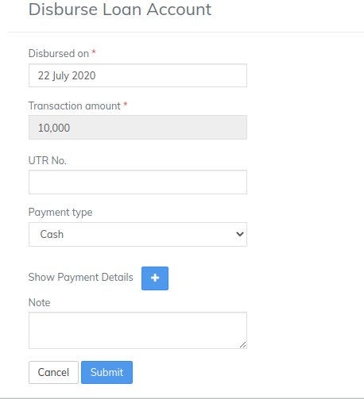
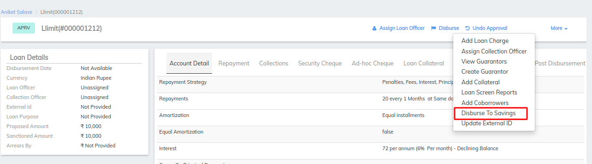
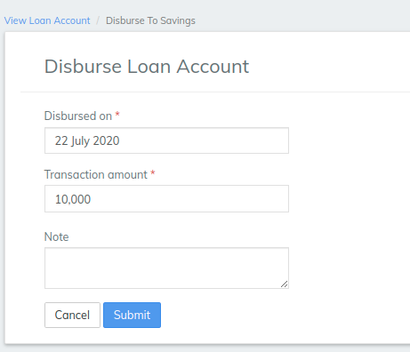
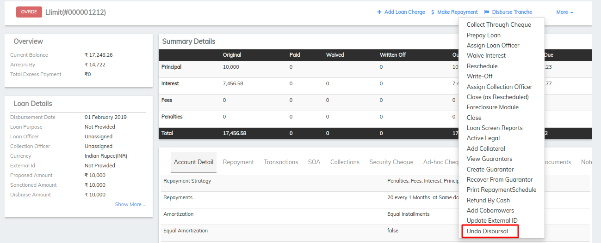

# How to Manage Loan Account Disbursement

## How to Manage Loan Account Disbursement 

Loan account applications that have been approved can be disbursed to a negotiable payment type (e.g., Cash, Check, M-Pesa) or to a saving account linked to the loan application. When a loan account is disbursed, its status changes from **Approved** to **Active**.

A disbursement made in error can be undone. When a disbursement is undone, the loan account status changes from **Active** to **Approved**.

#### **To disburse a loan account to a negotiable payment type** 

Locate the loan account by navigating to it through the client or group that holds the loan account.

1. Select **Disburse** from the action bar.
2. Select the **Disbursed on** date from the calendar pop-up.
3. Accept the default **Transaction amount** or type a different amount less than the default amount.
4. Select **Payment type** from the list.
5. Click **+** to add payment details.
   1. Account#
   2. Check#
   3. Routing code
   4. Receipt#
   5. Bank#
6. Type any relevant notes.
7. Click **Submit.**

****

The loan account will be disbursed and the loan account status updated to **Active.**

#### **To disburse a loan account to a saving account** 

Locate the loan account by navigating to it through the client or group that holds the loan account.

1. Select **Disburse to Saving** from the action bar.
2. Select the **Disbursed on** date from the calendar pop-up.
3. Accept the default **Transaction amount** or type a different amount less than the default amount.
4. Type any relevant notes.
5. Click **Submit.**

****

The loan account will be disbursed and the loan account status updated to **Active.**\

#### To Undo a Loan Account Disbursement 

Locate the loan account by navigating to it through the client or group that holds the loan account.

1. Select **Undo** **Disbursal** from the action bar.
2. Type any relevant notes.
3. Click **Submit.**

The loan account disbursement will be reversed and the loan account status updated to **Approved.**

## &#x20;

