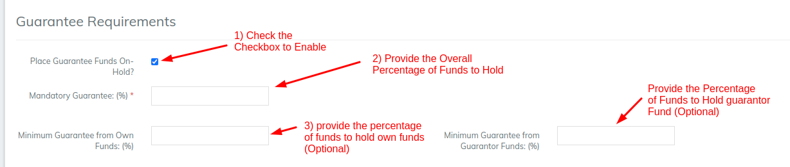
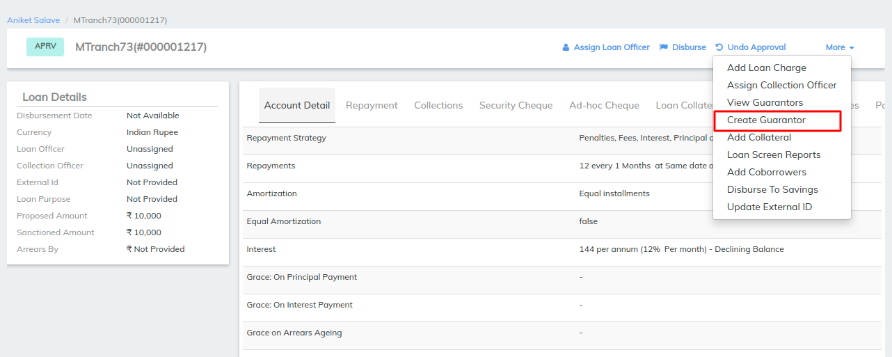
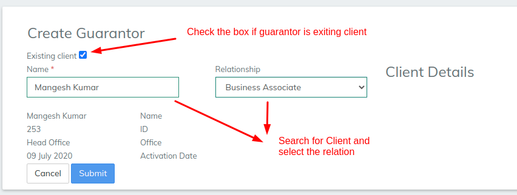
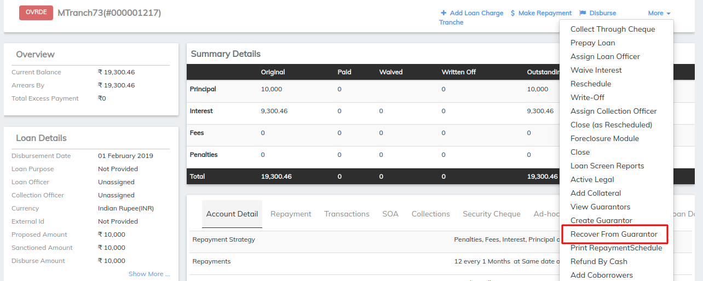

# How to Place Guarantee Funds On-Hold?

## How to Place Guarantee Funds On-Hold? 

When specifying guarantors for a loan, this feature allows user to specify what amount of the loan the guarantor stands as guarantee.

There are 2 types of guarantees:

&#x20;   **Own Guarantee**: One or more of own deposit accounts can act as guarantee.\

&#x20;   **Others Guarantee**: One or more of other clients/members and their deposit accounts can act as guarantee.

**Description:**&#x20;

* Loans are linked to savings account and savings amounts are blocked.
* The amount of guarantee becomes blocked (on-hold funds) - i.e. client cannot withdraw this amount but will continue to earn interest.
* If another member stands as guarantee, then funds can be clocked for savings account.
* As the loan gets repaid, the blocked funds get "released" (i.e. available for withdrawal) accordingly.
* Guarantor may belong to same group or may be outside the group. On agreeing to be a guarantor, a part of his/her "available funds" can be specified as guarantee and this amount gets "blocked".
* Guarantor funds gets "released" first, before loan account holder's funds are "released".
* If loan is rejected, then all guarantees for this loan are released.

#### Step 1:  

**Enabling "Place Guarantee Funds on-hold?"**&#x20;

Go to Admin>>Loan Product>>Create Loan Product.

#### Step 2:  

**Linking Savings account to the Loan account**

Client>>New Loan application>> Select Savings account to link to loan account.&#x20;

#### Step 3:  

In the Provided example, Loan application is being created for Anna White for a Loan amount of 10000 US$.

Percentage amount needs to be calculated manually outside the LMS.

Since here,

a) Guarantee from Own funds is 40% of the Loan amount, that will be 4000 US$.

b) Guarantee from Guarantor funds is 20% of the Loan amount, that will be 2000 US$.&#x20;

**Note:** This amount needs to be input in the amount field initially with respect to the Guarantee's.

**Create Guarantor**

In the Loan application page>>More>>Create Guarantor

a) Creating Guarantor for Own account and providing amount to block the funds from savings account.

b) Creating Guarantor for Other guarantees and providing amount to block the funds from savings account.

#### Step 4:  

Then Approve the Loan & Disburse.&#x20;

**Recovery from Loan:**&#x20;

&#x20;This enables recovering of provided percentage loan amount from Guarantor through linked savings account.&#x20;

**Funds getting released:**&#x20;

Once the Repayment start happening. The funds gets released automatically for savings account with respect to the provided percentage. Note: Guarantor funds gets "released" first, before loan account holder's funds are "released"

**Withdrawing amount from savings account**

Here In the image below, on trying to withdraw the set percentage, it will throw an error message as "Insufficient funds to complete the transactions."&#x20;

