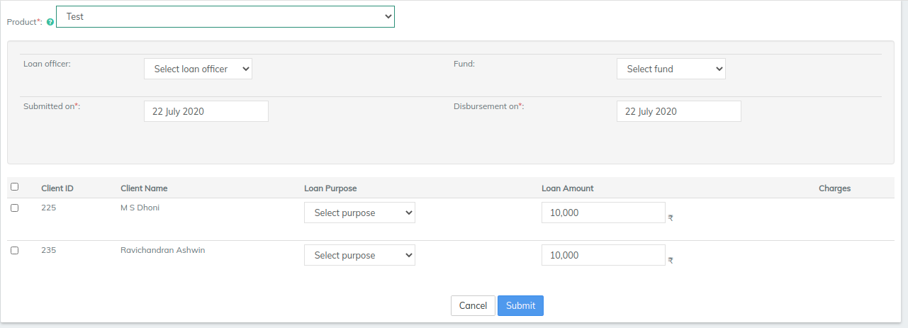
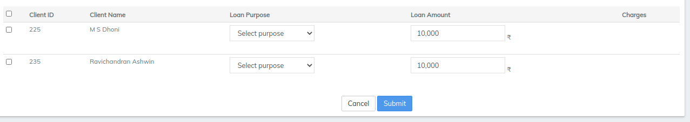

# How to Process Bulk JLG Loan Application

## How to Process Bulk JLG Loan Application 

Bulk Joint Liability Group (JLG) Loan Application enables you to process the JLG Loan for more than one Client in a single Group.

#### To Create Bulk JLG Loan Application: 

1. Go to specific Group and Click on 'Bulk JLG Loan Application' to see the following window. \

2 . Then Select the loan product and click on 'Submit' button to see the following hidden fields.

3\. Using '>>' , add the clients of the group who are eligible for JLG Loan and then click on 'Submit' button to see the JLG Loan Application as shown below.

.webp>)

4\. After this, on the same Loan Application you can see each Client's loan details.

.webp>)

.webp>)

.webp>)

5\. Finally, Click on 'Submit' button to create the JLG Loan Application.

6\. The Application needs to Approved and activated with Specified date. \
\
[Loan Product](../../admin/products-1/create-loan-product/) (fields)to see the meaning of each field in the loan product.

