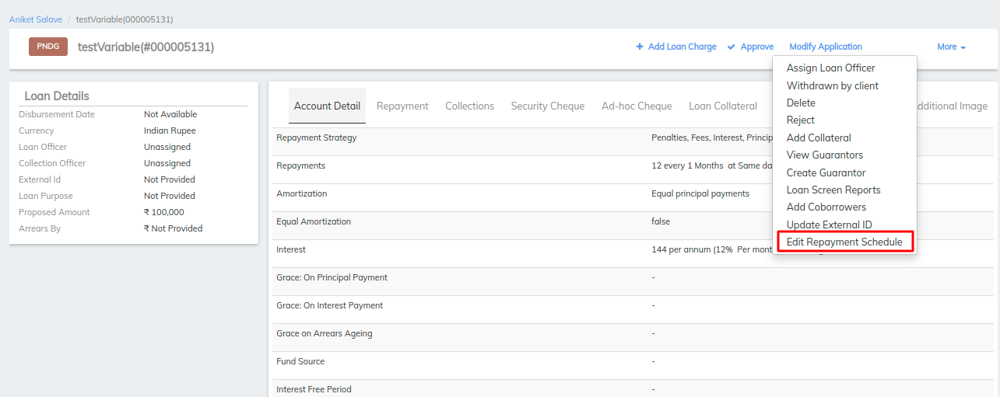
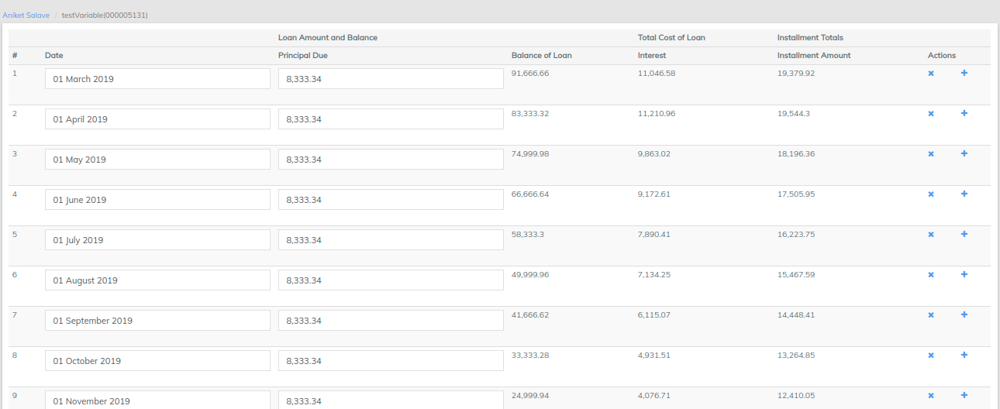
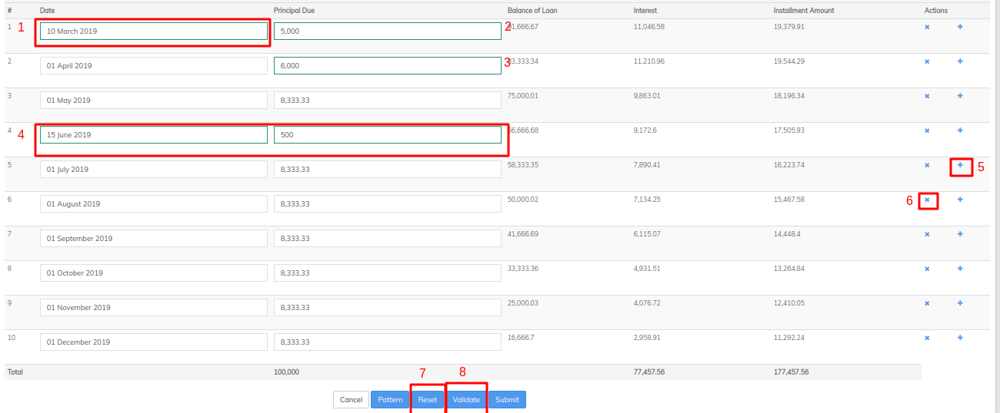
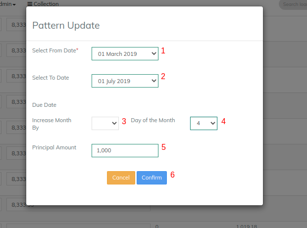
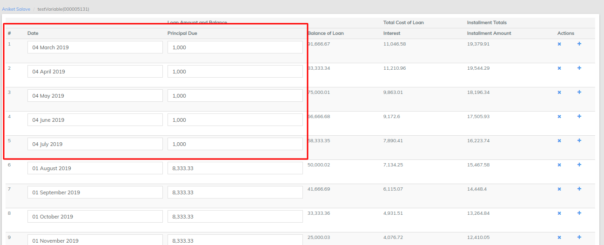

# How to provide variable installments

## How to provide variable installments 

#### **Create loan account with variable installments** 

To create a loan account application for a client, select **** the client by searching the desired client from Global Search. Click the **General** tab.

1. On the Client page, Click **+New Loan** on the bright blue action bar.
2. Select the loan product to base the loan account on from the product list.
3. Complete the [Loan Account Fields](loan-account-fields.md), making any modifications from the default that are permitted and applicable to the loan application.
4. Click **Submit**.

The loan account application will be created with a status of Pending Approval. Your financial institution will define the workflow and permissions for approving loans.

Note:- You could provide the variable installments at the Loan in pending for approval status.&#x20;

**Step 1)** Go to Existing loan account>>Pending Approval status.&#x20;

&#x20;           Click on More>>Edit repayment schedule&#x20;

**Step 2 - i)**&#x20;

&#x20;          a) Showing repayment schedule&#x20;

b) An example in the screen shot below:

1 - Changed date to 10th, February from 1st, February.

&#x20;           2 - Changed amount to 600 from 1094.

&#x20;           3 - Changed amount to 500 from 1094.

&#x20;           4 & 5 - Created new installment by using + button prior to this installment.

&#x20;           6 - "x" use this button to remove installment.&#x20;

&#x20;           7 - Click on Reset button to reset values to normal installment schedule.&#x20;

&#x20;           8 - Click on Validate button to validate updated details.&#x20;

&#x20;           Then click on Validate and submit button. &#x20;

**Step 2 -ii) Using pattern**&#x20;

&#x20;               **a)** Creating pattern, Click on **Pattern** button

From date - Provide from date. In this example: 1st February.&#x20;

&#x20;             2 - To date - Provide to date. In this example: 1st July.

&#x20;             3 - Increase month by - Provide increase by month. In this example: None.

&#x20;             4 - Day of the Month - Provide day of the month. In this example: 5th&#x20;

&#x20;             5 - Installment amount -  Provide installment amount. In this example: 1000

&#x20;             6 - Confirm - Click on **confirm** button.&#x20;

&#x20;         b) Viewing created pattern, a screenshot below showing a created pattern and schedule.&#x20;

Then click on submit and complete the loan process.

