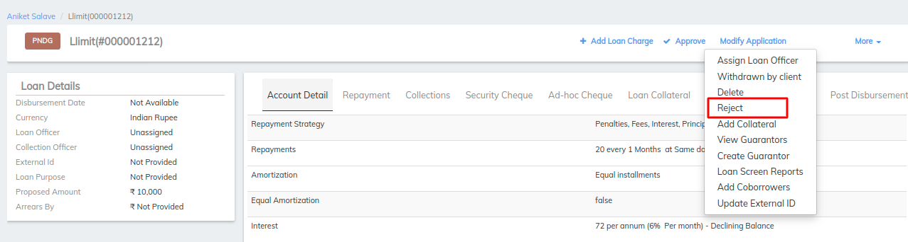
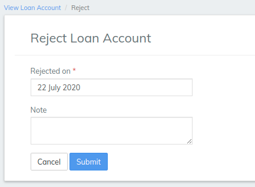

# How to Reject a Loan Account Application

## How to Reject a Loan Account Application

#### **To reject a loan account application** 

Locate the loan account by navigating to it through the client or group that holds the loan account.

1. Select **Reject** from the more.
2. Select the **Rejected on** date from the calendar pop-up.

1. Type any relevant notes.
2. Click **Submit.**

