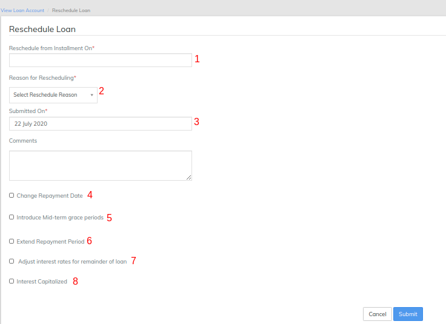
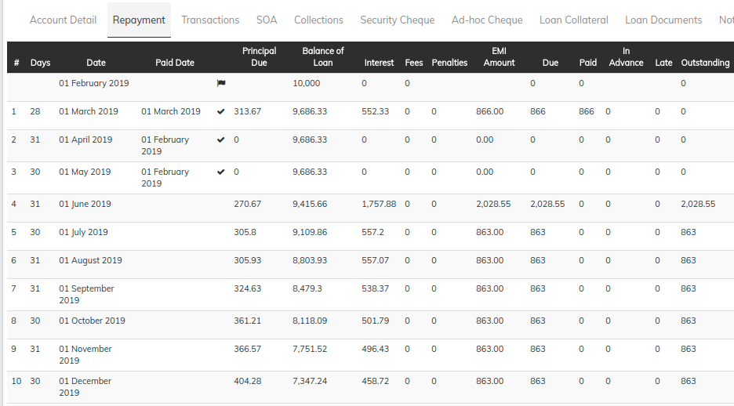

# How to reschedule loan

## How to reschedule loan 

Rescheduling and Restructuring loans has been a feature in high demand and will allow financial institutions to better manage their portfolio in arrears by giving their clients flexible options to maximize the possibility of recovery.

Thanks to the Musoni team for contributing the code-level changes to the LMS platform to support loan rescheduling.

Four different scenarios to reschedule or refinance loans are now supported. One or all of the adjustments can be applied to a single loan.

#### **Create loan account**  

To create a loan account application for a client, select **** the client by searching the desired client from Global Search. Click the **General** tab.

1. On the Client page, Click **+New Loan** on the bright blue action bar.
2. Select the loan product to base the loan account on from the product list.
3. Complete the [Loan Account Fields](loan-account-fields.md), making any modifications from the default that are permitted and applicable to the loan application.
4. Click **Submit**.

The loan account application will be created with a status of Pending Approval. Your financial institution will define the workflow and permissions for approving loans.&#x20;

a) Showing screenshot of current repayment schedule. In this example, Repayment is done on 1st February.       &#x20;

#### **Rescheduling Loan**  

Once the loan is under Active status after loan is disbursed, you could reschedule the loan. &#x20;

#### Step 1) Going to reschedule option  

&#x20;Go to Loan account page>>More>>Click on **Reschedule** button.&#x20;

#### Step 2) Reschedule loan page  

&#x20;             Update required fields&#x20;

**1 - Reschedule installment on -** Provide reschedule installment on date. In this example, installment is rescheduled to the 1st March 2015.

&#x20;          **2 - Reason for rescheduling -** Provide reason for rescheduling.

&#x20;          **3 - Submitted on -**&#x20;

&#x20;          Check the check box for the required optional parameters (4 to 8) below.&#x20;

&#x20;          **4 - Change repayment date -** Provide installment rescheduled to date. In this example, installment is rescheduled to the 5th March 2015.

**.           5 - Introduce Mid-term grace periods -** Provide Principal Grace Periods. In this example, None.

&#x20;                                                                          \- Interest Grace Periods value. In this example, None.

&#x20;          **6 - Extend Repayment period -** Provide Number Of new Repayments. In this example, None.

&#x20;          **7 - Adjust interest rates for remainder of loans -** Provide New Interest Rate. In this example, None.

&#x20;          **8 - Recalculate interest based on new terms -** Just check the check box if you want to enable Recalculate interest based on new terms. In this example, None.&#x20;

&#x20;          9 - Click on **Submit** button.&#x20;

#### Step 3) Approve/Reject page  

Click on **Approve** button & provide the date and **submit** in order to reschedule loan. &#x20;

#### View reschedule loan - installment  

Showing rescheduled installment screenshot &#x20;

## &#x20;

