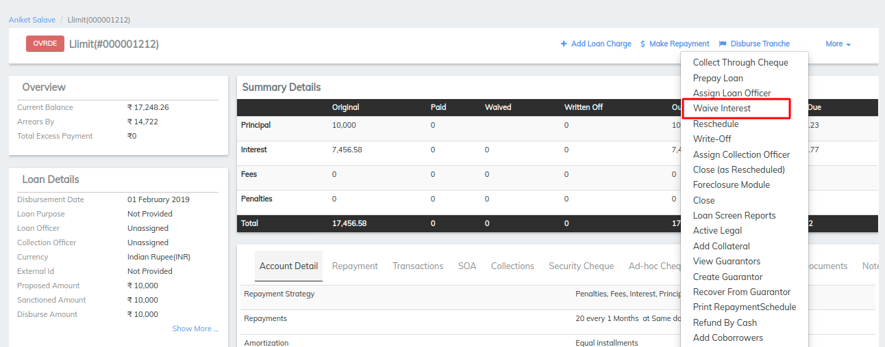
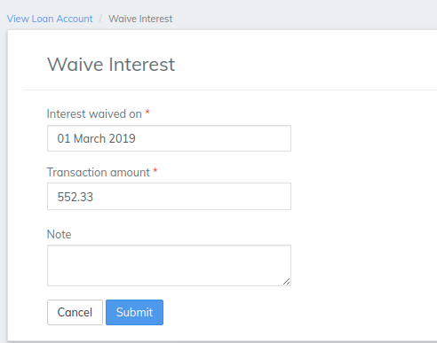

# How to Waive Interest for a Loan Account

## How to Waive Interest for a Loan Account 

To waive interest for a loan account, a LMS user must be granted permission to do so.

The amount of interest to be waived can be specified when completing the transaction. The amount will default to interest amounts that are in arrears on the transaction date if any, or the total interest payable on the loan if interest is not in arrears.

Before waiving interest, review the information on the loan account summary tab to confirm the amount of interest to be waived.

#### To waive interest for a loan account 

To waive interest for a client or group loan account, select **** the client or group (_needs link to how to find a client or group)_. Click the **General** tab.

1. Click the loan account for which interest is to be waived.
2. On the loan page, click the **Summary** tab to review loan information and confirm interest amount to be waived.
3. Click **More**, **Waive Interest** on the action bar.
4. Accept the date default for **Interest waived on** or pick a date in the past from the calendar pop-up.
5. Accept the **Transaction amount** default or type a different amount.
6. Optionally, type a descriptive **Note**.
7. Click **Submit**.
8. Review the loan account **Summary** once more to confirm the interest amount has been waived.

The loan account interest amount will be adjusted by the amount waived.

## &#x20;

