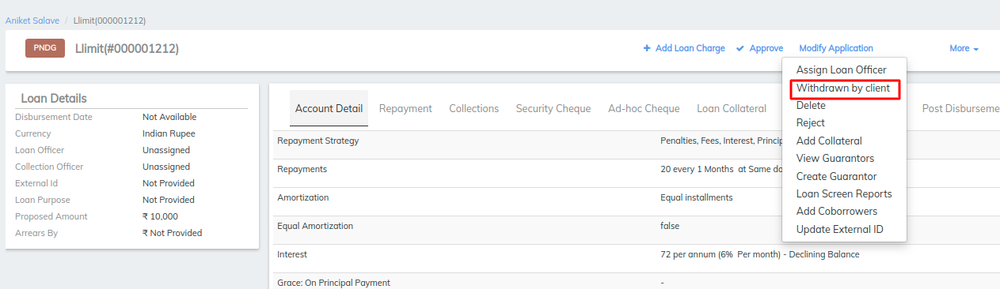
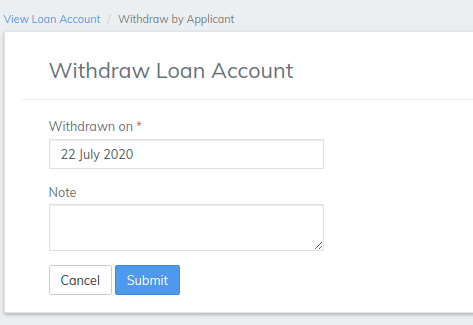

# How to Withdraw a Loan Account Application

## How to Withdraw a Loan Account Application

Loan account applications that have a status of Pending Approval may be withdrawn (typically a loan account application is withdrawn on the request of the client or group). When a loan account application is withdrawn, its status changes to Cancel (withdrawn).

#### **To withdraw a loan account application** 

Locate the loan account by navigating to it through the client or group that holds the loan account.

1. Select **Withdrawn by client** from the action bar (under the **More** menu choice).

1. Select the **Withdrawn on** date from the calendar pop-up.

1. Type any relevant notes.
2. Click **Submit.**

