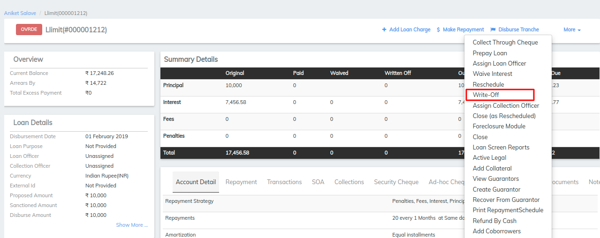
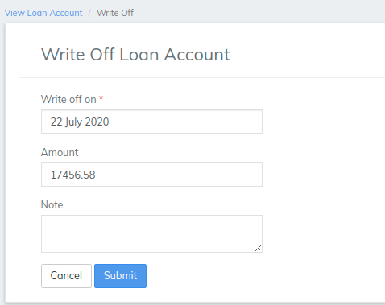

# How to Write-off a Loan Account

## How to Write-off a Loan Account 

To write-off a loan account, a LMS user must be granted permission to do so.

#### To write-off a loan account 

To write-off a client or group loan account, select **** the client or group. Click the **General** tab.

1. Click the loan account to be written-off.
2. Click **More**, **Write-off** on the action bar.
3. Accept the date default for **Write off on** or pick a date in the past from the calendar pop-up.
4. The **Amount** to be written off will display.
5. Optionally, type a descriptive **Note**.
6. Click **Submit**.

The loan account status will be changed to Closed (Written-off).

