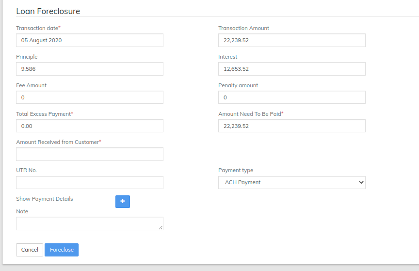

# Loan Foreclosure Strategy

LMS has two Foreclosure strategies which can be selected via creating the product for any loan account. When paying on a loan, your payment amount may not always match the payment amount specified in the original loan terms. In fact, you may choose to pay more than required.&#x20;

LMS has two foreclosure strategies which are Standard Foreclosure and Recalculate Interest on Remaining Balance refer the image below

1. **Standard Foreclosure** - It is an existing part of your **personal loan** process in which you can repay the **loan** before your scheduled EMI period. You can select the number of EMIs that you have already paid and the month in which you want to **foreclose** your **loan**. This will help you **calculate** the **foreclosure amount**. In LMS by default its Standard Foreclosure though its not selected while Product creation.

.png>)

Above image shows how the interest is calculated in standard foreclosure strategy. In the above Image the Principal amount was 10000 and Interest rate is 12 , one repayment of 1614 is made and then the loan is foreclosed. Hence the interest is calculated on the outstanding principal amount i,e 9586

2\. **Calculate Interest On Remaining balance** -  This strategy Of loan foreclosure is used when the lender wants to recalculate the interest on remaining balance. the image below shows an example of the strategy

As we can see the Initial Principal amount was 10000 and one repayment is made of 1614 according to 12% interest monthly and the remaining months are 11 months in the tenure.
