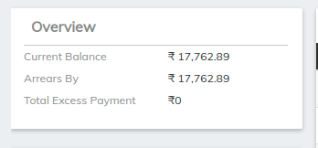

# Loan Screen Overview

#### **To create a loan account application for a client** 

To create a loan account application for a client, select **** the client by searching the desired client from Global Search. Click the **General** tab.

1. On the Client page, Click **+New Loan** on the bright blue action bar.
2. Select the loan product to base the loan account on from the product list.
3. Complete the [Loan Account Fields](loan-account-fields.md), making any modifications from the default that are permitted and applicable to the loan application.
4. Click **Submit**.

The loan account application will be created with a status of Pending Approval. Your financial institution will define the workflow and permissions for approving loans.

### Loan Screen Overview

Loan screen will gives an Idea about loan summary loan overview, loan details and other Tabs

1. Overview
2. Loan Details
3. Summary Details
4. Tabs( account Details , repayment schedule,  Transactions, SOA)
5. Add Loan Charge
6. Make Repayment
7. Foreclose
8. More

### **1.** Overview&#x20;

_**Current balance**_ - it is simply the remaining amount you have left to pay on your **loan**. ... Every **loan** you take out will have a **loan balance** until the **loan** is entirely paid off. Your **loan balance** changes on a daily basis because interest is added daily.

_**Arrears By**_ - **Arrears** is a financial and legal term that refers to the status of payments in relation to their due dates. ... If one or more payments have been missed where regular payments are contractually required, such as **mortgage** or rent payments and utility or telephone bills, the **account** is in **arrears**

### 2. Loan Details

* _**Disbursement Date**_ - the date upon which the Loan proceeds are funded by Lender into escrow in connection with the closing of the Loan. ... Disbursement Date means any Business Day when Loan principal is advanced under this Note to or on the account of Borrower.
* _**Loan Purpose**_ -  to show the underlying reason an applicant is seeking a loan. The purpose of the loan is used by the lender to make decisions on the risk and may even impact the interest rate that is offered.
* _**Loan Officer**_ - are people who work for banks and other financial institutions with the main objective to recommend individual and business loan applications for approval and participate in the front end of the mortgage origination process
* _**Collection Officer**_ - Collections Officers are responsible for managing the collection of outstanding debts from clients and customers. They are hired by businesses and collections agencies to inform customers of their overdue bills and attempt to collect payment to mitigate company losses.
* _**Currency**_ - in which currency the loan amount is disbursed
* _**Proposed Amount**_ - Proposed Loan Amount means the proposed amount of the **Loan** to be made set forth in the Proposed Utilisation Notice.
* _**sanctioned Amount**_ - The sanction of a loan signifies that you are eligible for the loan
* _**Disbursed Amount**_** -** also called a cash disbursement or cash payment, refers to a wide range of payment types made in a specific period, including interest payments on loans and operating expenses. ... Disbursement **** can also refer to a loan payment, such as a student **** loan**.**
* _**Total Deduction Amount -**_ The deduction allowed is the total interest part of the EMI paid during the financial year. There is no limit on the maximum **** amount that is allowed as deduction.
* _**Net Disbursed Amount**_ - Net Disbursement Amount means the proceeds of the Financial Transaction less the aggregate amount of any commissions, fees and costs related to such Financial Transaction and to the preparation and execution of it and the costs referred to in Clause 6(4) in relation to any Instalment, resulting to an amount to be disbursed to the Borrower
* _**Performance history**_
  * _**No of Repayments**_
  * &#x20;_**Maturity date**_

### _**3. Summary Details**_

summary Details - it shows the principal amount, interest fees paid and overall summary of loan that is the total amount overdue, outstanding amount, written off and waived &#x20;

### 4.  Detail Tab

1. **Account Details** - It is nothing but a Detailed product we have created for particular loan account it shows amortization grace on period interest, repayment strategy and other fields for reference -[Loan Account Fields](loan-account-fields.md)

2\. **Repayment Schedule** - Repayment Schedule means the schedule of loan payments established prior to the commencement of the Repayment Period with respect to a Student Loan, which schedule sets out the amount and timing of installments necessary to pay such Student Loan in full within the applicable Repayment Period.


 This shows the payment is done for respective month&#x20;



 This Represent the partial payment for the respective Month


3\. **Transactions** - The payment made for any repayment is reflected in transaction Tab. Interest capitalised or the amount  is paid via scheduler jobs reflects in transactions tab . by clicking on particular transaction the can be undo as well. View Journal option shows journal entries for the transaction, accruals and waived charges can be hide and shown using buttons as shown in the image below

_Undo Transaction -_ Particular transaction can be undo bu clicking on the transaction will lead to the another screen as shown below simply click on undo the pop will ask for transaction date and remark which are mandatory and Undo transaction will revert&#x20;

4\. **Statement OF Account(SOA)** -An account statement is a periodic statement summarizing account activity over a set period of time. Account statements can be thought of as a summary of the account and include statements of services provided, fees charged, and money owed. An account statement is a periodic summary of account activity with a beginning date and an ending date. The most commonly known are checking account statements, usually provided monthly, and brokerage account statements, which are provided monthly or quarterly. Monthly credit card bills are also considered account statements.

Accruals and waived charges can be hide in SOA by checking the box as shown in above image. PDF of account statement can be exported via export PDF option&#x20;

#### KEY TAKEAWAYS 

* An account statement is a periodic statement summarizing account activity over a set period of time.
* Account statements can be thought of as a summary of the account and include statements of services provided, fees charged, and money owed.
* Account statements should be scrutinized for accuracy, and historical statements are critical for budgeting.

5\. Collections - LMS Provides the Collection tab which saves the collection which are cash PDC or NACH, collections details can be filled up while disbursing loan. it will ask for how each repayment will be collected in terms of cash,PDC or NACH. refer below image

\>>In collection tab by clicking on enter details it will ask for account no, bank details and payment type., LMS also provides an option where we can select no of EMI or all EMI and marked them as what its should reflect in  collection tab. By default it is cash but we can have them as PDC or can be ACH. once we filled the fields submit and disbursed the loan&#x20;

Collection can be updated by selecting mark as registered, demand generated, cleared ,failed or bounced. selecting the no of repayment and select the status to be changed accordingly as we can see in the above image&#x20;

\>>by default it is Not registered but once the payments are made or we want to generate a demand need to select the repayment and then change it to the status we want&#x20;

\>>Repayment Using Collection To call the repayment api after a collection status is changed

* Configure the PDC/ACH Repayment Triggers from configurations
* Set the state in which repayment should occur to active(Eg. Cleared).
* Now when the collection is changed to the state specified above(Eg. Cleared) the repayment api is called.

For Swapping.

An Already existing collection can be swapped with new collection from 1) The Collection Tab in Loan Screen 2) From the Collection Module

* To swap the collection, select the collection and proceed to the drop down near the update collection button.
* Then press swap collection
* The screen that opens, enter details of the new collections and click on swap.
* If a swap charge was associated with the loan, a charge is added automatically after the collection is swapped.

_Invoices_ - **Invoice financing** is a form of short term borrowing which is extended by the bank or a lender to its customers based on unpaid **invoices**. ... Unpaid **invoices** are accounts receivable, which **means** that the company will receive that amount but at a later date.

As we can see the above image it will ask for invoice number, invoice amount, invoice raised to, invoice date and invoice receivable date and click on Add button.we can add multiple invoices to a single client. once the invoice is added it will reflect in the invoice tab in loan screen.Invoices will be created while disbursing a loan only if the Bill-Discounting option is selected while creating a product&#x20;

Invoice tab provides a knock off button which will pay the invoice raised to a client once you hit the knock off it will redirect you to a following scree

\>> By putting Transaction date just click on submit and the payment will be done and loan status will be changed.

6\. Security Cheque - A Security Cheque is a cheque issued to a drawee as security or surety, for using in case the drawer fails to meet the future obligations arising during course of business or any other such transactions.

7\. Ad-hoc Cheque - Allows a user to add a single payment to an order without going through any processing gateway. For example, if a user pays for an order with cash or a check the admin could add an ad hoc payment to the order with the type "Cash". All ad hoc payments require a comment to be left that describes the payment

8\. Loan Collateral - The term collateral refers to an asset that a lender accepts as security for a loan. ... The collateral acts as a form of protection for the lender. That is, if the borrower defaults on their loan payments, the lender can seize the collateral and sell it to recoup some or all of its losses.

\>> Mandatory fields has to be filled according to add loan collateral as we can see above image and hit submit once the loan collateral is created it can be deactivated and also can edit the collateral from the loan collateral tab refer below image

9\. Upload Document - Any loan related documents can be uploaded via this tab for ex statement of account

### 5. Add Loan Charge

Charges (fees and penalties) can be charged to loan accounts in three ways:&#x20;

* Charges are inherited from the product definition. A loan officer may have the ability to remove one or more of these charges from a loan account. When a charge is removed from a loan account, other loan accounts are not affected.
* Charges (not yet associated with the loan account) can be selected and attached to the loan account.
* Miscellaneous charges (one time charge) can be charged to a loan account. The loan officer specifies the amount, which is added in the next payment.


Refer to the following page [How to Add a Charge to a Loan Account](how-to-add-a-charge-to-a-loan-account.md)


### 6. Make Repayment


[how-to-make-repayments-on-a-client-loan-account.md](how-to-make-repayments-on-a-client-loan-account.md)


### 7. Foreclose

If your organization makes real estate loans, you will need to have a Foreclosure Policy in place.  Use this as the base to create a policy for your organization.

**PURPOSE:** The Board of Directors recognizes that from time to time the credit union may have to foreclose on a real estate loan. In light of this, the following policy is established to ensure:&#x20;

* An appropriate Risk Assessment for foreclosing and holding of a foreclosure is properly performed.
* Levels of risks are established in relationship to holding a foreclosure.
* Proper accounting of the foreclosure is done.
* A strategy for either the liquidation or holding of the foreclosure is done.

**FORECLOSURES AND RESPONSIBILITY:**

As a last resort, the organization will begin the process of foreclosing on the property…In doing so the organization will follow all foreclosure laws and will do so by obtaining appropriate legal counsel.

Foreclosure should be initiated when a real estate secured loan becomes ninety (90) days (depending on the collateral and the individual situation) contractually past due and satisfactory up-to-date payment arrangements cannot be obtained, or when a real estate secured loan is determined to be unrecoverable for any other reason.  The action to proceed with foreclosure must be taken seriously, and upon a full review of the account information.

The CEO is responsible to establish if a workout loan or foreclosure is in the best interests of the credit union and the client. Prudent workout arrangements, in the long term, can be in the best interest of both the credit union and the client. However, when foreclosure is unavoidable, the credit union will seek legal counsel to consider all the risks associated with the foreclosure and the liquidation of the foreclosure.&#x20;

The CEO must approve foreclosures after an analysis of the anticipated equity in the real property and the borrower's financial situation.


[loan-foreclosure-strategy.md](loan-foreclosure-strategy.md)


**WORKING WITH REAL ESTATE LOAN BORROWERS:**

If a decision is made to proceed with a foreclosure, copies of the Note and Mortgage are sent to the attorney selected for legal action along with any required retainer.  The Director of Lending should contact the attorney periodically to update the status of any legal accounts and ensure proper follow-up.

The Director of Lending should place a comment "Refer to Attorney" on the account.

It is important to keep record of all expenses paid in the client's folder, including legal, updated appraisals, title, etc.  All collection costs will be added to the outstanding loan payoff balance.

Once the account has been forwarded to the attorney, if the owners of the property contact the attorney regarding reinstatement, it is important to refer them to our foreclosure attorney.  The organization's acceptance of money/payment from the client may remedy the default without total payment of expenses, and/or require the organization to re-initiate the foreclosure process.  Our attorney will advise as to whether to accept any loan payments while the account is in the process of foreclosure.

In the event the organization wishes to cancel or postpone the trustee's sale, the Director of Lending will furnish written instructions to the foreclosure attorney.  We must also advise our attorney if the organization intends to seek a deficiency judgment or collect rent from the subject property.

The attorney will file all required documentation with the appropriate judicial authority, advertise the property in appropriate media, provide the credit union with copies of all papers filed and documents created in the process.  The trustee's sale date is usually 90 days from the date the paperwork is submitted to the proper authorities, although this can vary with the number of foreclosures being processed by the County and any delays along the way.

If a client desires to reinstate their loan after the organization has initiated foreclosure, the client must pay all past due payments plus any foreclosure (attorney) costs that have been incurred.

If the property goes to foreclosure auction, the organization will work with the attorney to set the opening bid for potential buyers.  This will take into consideration any superior liens, the value of the property, the balance owed on our loan and the number of potential buyers, among other factors.  If no acceptable bids are made, the organization will purchase the property at the opening bid price.

If the auction price is accepted, the auctioneer and the organization attorney will complete the paperwork to document the price, buyer and conditions of the sale.&#x20;

The time it takes from the date of the initial foreclosure action to final ratification can be anywhere from one to over two years, depending on the volume of foreclosures, how quickly the sales are processed by the court and if any objections are raised.  Until the final ratification is received, while the buyer has an interest in the property, the buyer cannot begin to take possession of the property (i.e., evict tenants, gain entry to house, change locks, dispose of household property, etc.).

If organization purchases the property, a determination will be made by the CEO upon the best method of marketing the property and what repair costs should be authorized.  All pertinent foreclosure sale information will be recorded to insure we account for the property in our financial reports and obtain satisfactory insurance on the property.

### 8. More

* waive Interest - For reference [How to Waive Interest for a Loan Account](how-to-waive-interest-for-a-loan-account.md)
* Reschedule - For Reference [How to reschedule loan](how-to-reschedule-loan.md)&#x20;
* Write-off - For Reference [How to Write-off a Loan Account](how-to-write-off-a-loan-account.md)
* Foreclosure Module - This will calculate the foreclosure module for client to send&#x20;

* Add Collateral - For reference [How to Add Collateral to a Loan Account](how-to-add-collateral-to-a-loan-account.md)
* Add Guarantor / Create guarantor - For reference [How to Add/Remove/Modify a Guarantor to a Loan Account](how-to-add-remove-modify-a-guarantor-to-a-loan-account.md)
* Close - For Reference [How to Close a Loan Account](how-to-close-a-loan-account.md)
* Undo Disbursal - This will undo-disbursed the loan and will go to approve stage hence has to disbursed again&#x20;

&#x20;

****

****
