# Loan with term vary based on loan cycle

## Loan with term vary based on loan cycle 

Loan with term vary based on loan cycle enables defining loan cycle with respect to their terms, interest and principal. This is for those whose business practice is loan amount which is increased for the second loan cycle on completing the first loan cycle on time. &#x20;

This is defined in the loan product itself by enabling "Terms with vary based on loan cycle" in Term section. &#x20;

Beginning at the main screen, select [Administration](../../admin/administration/), then **Products** from the drop-down menu. This will launch the **Products** menu.

Select **Loan Products.**&#x20;

.png>)

#### Create Loan Product  

#### **Details**  

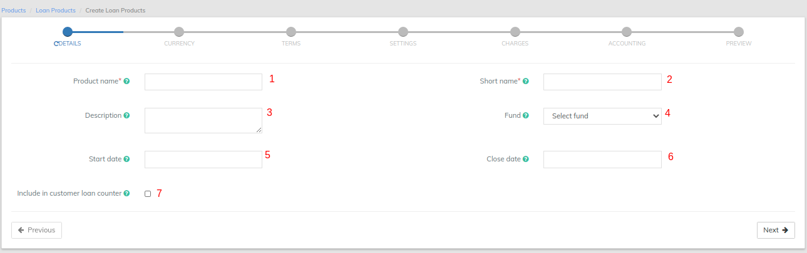

Note: All red coloured asterisk mark are mandatory fields. \
Please refer **Details - Image**, the mentioned Details below are updated with respect to the provided fields numbers.  &#x20;

* 1 - Provide **Loan Product name** (Mandatory).&#x20;
* 2 - Provide **Short name** (Mandatory).

&#x20;         3 - Provide description of this product.       &#x20;

&#x20;  4 - Select Fund source. Need to have defined required funds: [Manage Funds](https://mifosforge.jira.com/wiki/display/docs/Manage+Funds).           5 - Provide Loan product Start date.         &#x20;

6 - Provide Loan product Close date. Note - Loan product cannot be used after this date.        &#x20;

&#x20; 7 - On checking the check box, it captures number of loan taken by customer.&#x20;

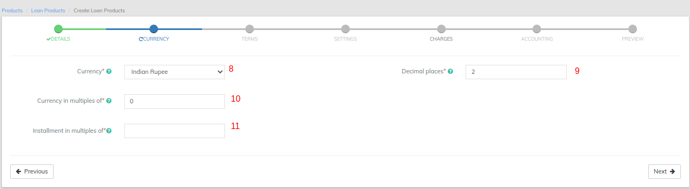

* 8 - Select **Currency** (Mandatory). Need to have defined required currency: [Currency Configuration](https://mifosforge.jira.com/wiki/display/docs/Currency+Configuration)
* 9 - Provide **Decimal places** (Mandatory).&#x20;
* 10 - Provide **Currency in multiples of** (Mandatory). This is to provide total amount rounding off. For example: 10, so Total amount gets rounded of to 10s.&#x20;
* 11 - Provide I**nstallment in multiples of** (Mandatory). This is to provide installment rounding off. For example: 10, so Installment amount gets rounded of to 10s.&#x20;

#### **Terms** 

**Follow If your loan product is based on Loan cycle.**&#x20;

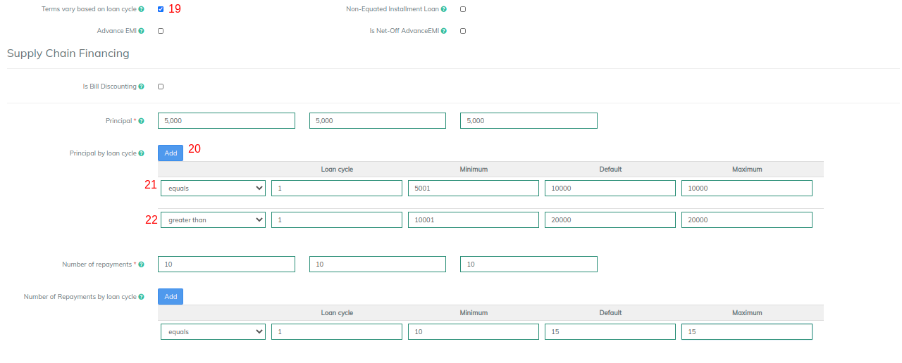

19 - Check the check box to enable "**Terms vary based on loan cycle**".&#x20;

20 - Provide values in principal section. Click on Add button to define Principal by loan cycle.In the image shown above:&#x20;

21 - Equals - Loan cycle as 1 with Principal Default amount of 10000. (If there was one more cycle, it could be defined as Equals - loan cycle as 2 with principal amount).&#x20;

22 - Greater than -  Loan cycle as 1 with Principal Default amount of 20000. Greater than should always be used for the last cycle.&#x20;

23 - Define Number of repayments by loan cycles in the same way. Then continue defining other steps from Section A - 14 to 18.&#x20;

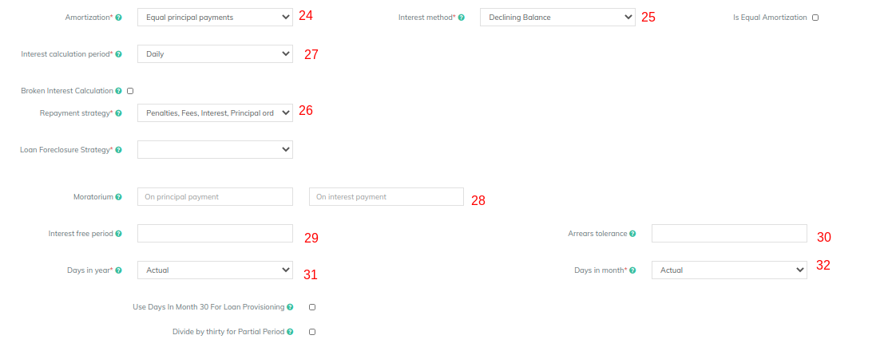

* 24 - Select **Amortization**: Depending upon the type of amortization you practice select one. &#x20;

&#x20;                Equal Installments - All repayment amounts will be equal but the principal and interest amounts will vary with each repayment.            Or Equal Principal Payments - All principal amounts will be equal but the repayment and interest amounts will vary with each repayment.

* 25 - Select **Interest method**: Depending upon the type of interest method you practice, select one.

&#x20;               Flat, For formula reference - [Interest Method](broken-reference)            Or Declining Balance, For formula reference - [Interest Method](broken-reference)

* 26 - Select **Repayment strategy**: The repayment strategy determines the sequence in which each of the components is paid. For more information on Repayment strategies: [Loan Product](../../admin/products-1/create-loan-product/) - Repayment strategy.&#x20;
* 27 - Select **Interest calculation period**:&#x20;

&#x20;              Daily - Will Calculate the interest on DAILY basis. For example: Month of February has 28 days and it will calculate interest for 28 days,            Or SAME AS REPAYMENT PERIOD- it calculates for the month, that is, 30 days.          28 - Provide Moratorium (Optional):&#x20;

* If Principle Payment is '6' and the client's Repayment Frequency is every month, then for the first six months, the client has to pay Interest only and after six months the client starts paying principle amount too.
* If Interest Payment is '6' and the client's Repayment Frequency is every month, then for the first six months, the client has to pay Principle only and after six months the client starts paying Interest amount too.

&#x20;         29 - Provide Interest free period (Optional): If the Interest Free Period is '4' and the client's Repayment Frequency is every week, then for the first four weeks the client need not to pay interest, he has to pay principle due for that week only.           30 - Provide Arrears tolerance (Optional): With 'Arrears tolerance' you can specify a tolerance amount and if the loan is behind (in arrears), but within the tolerance, it won't be classified as 'in arrears' and part of the portfolio at risk.

* 31 - Select **Days in year**: Depending upon your organizations financial days select respectively.

&#x20;                 Actual - Will consider number of days with respect to actual calendar. Or 360 days Or 364 days Or 365 days.  &#x20;

* 32 - Select **Days in Months:** Depending upon your organizations financial practice select respectively.&#x20;

&#x20;                 Actual - Will consider number of days with respect to actual calendar. Or 30 days.           33 - Provide "Allow fixing of installment amount" (Optional): On checking the check box it enables providing the installment amount manually at the loan account level.                   Example: If the repayment amount every installment is 107 and you want to give it has 105. On providing 105 amount manually, it automatically adjusts the schedule for all the repayments.           34 - Number of days a loan may be overdue before moving into arrears (Optional): [Loan Product](../../admin/products-1/create-loan-product/) (loan product fields)        35 - Maximum number of days a loan may be overdue before becoming a NPA - non performing asset (Optional): [Loan Product](../../admin/products-1/create-loan-product/)(loan product fields)       36 - Account moves out of NPA only after all arrears have been cleared?: On checking the check box, Loans which are NPA will only move out of NPA after all arrears have been cleared.           37 - Principal Threshold (%) for Last Installment:&#x20;

#### Interest Recalculation (Optional)  

38 - On checking the check box for "Recalculate Interest" - It will enable Interest recalculation. For more information on Interest recalculation refer -   [Recalculate Interest](broken-reference) (Interest Amount Recalculation for Loan Accounts)

#### Guarantee Requirements (Optional) 

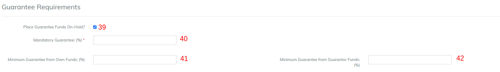

39 - Checking the check box will enable "Place Guarantee Funds On-Hold". 40 - Mandatory Guarantee (%): This is to provide total % of loan amount as mandatory guarantee. Example: 20%. 41 - Minimum Guarantee from Own Funds (%):  Example: 10% of loan amount from Own funds.  42 - Minimum Guarantee from Guarantor Funds (%): Example: 10% of loan amount from Guarantor Funds.&#x20;

#### &#x20; 

#### Configurable terms & settings (Optional)  

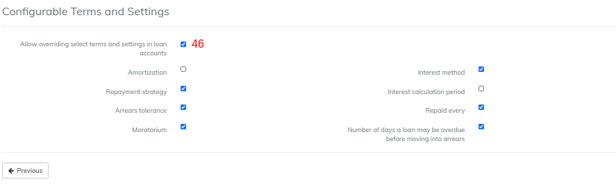

46 - By default "Allow overriding select terms and settings in loan accounts" is checked (Enabled). If you don't want to allow over ridding for the mentioned categories, then you could uncheck the box.&#x20;

#### Charges 

In order to use Add charge, you should have already defined it in charges. For more information on charges refer here: [Charges](../../admin/products-1/charges.md)

#### Overdue Charges 

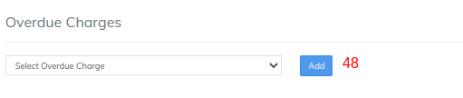

In order to use Add overdue charge, you should have already defined it in charges. For more information on charges refer here: [Charges](../../admin/products-1/charges.md)

#### Accounting  

.png>)

**By default Accounting will be disabled - None:-** Meaning If you are using this product for various transactions like disbursement, repayment, etc. These transactions are not passed in journal entry.  \
**Enabling accounting for the loan product**:->> You should have created chart of accounts,  To enable Accounting, you need to select either one of the account type below depending upon your organization accounting practice. &#x20;

* Cash&#x20;
* Accrual (periodic)&#x20;
* Accrual (upfront) \

\>> Map accounts with respect to the loan product accounts. For information on these accounts refer: - [Accounting Rules](../../admin/accounting/accounting-rules.md) for loans.&#x20;

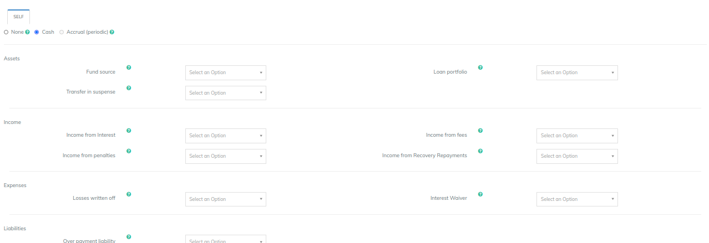

**Advanced Accounting Rule**&#x20;

Clicking on the show button enables Advanced accounting rule.&#x20;

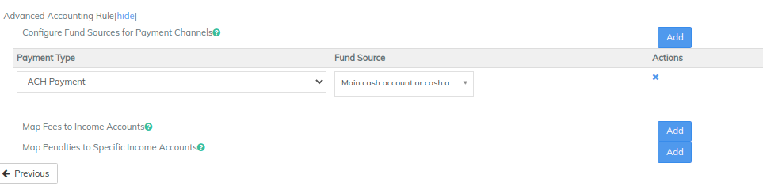

If you click on Add button, it will expand and show up selection drop-downs.&#x20;

* Configure Fund sources for Payment Channels. \
  Example: In the shown image above, Payment type - Cheque is mapped to Fund source - Bank. So whenever payment type is used for transaction, journal entry for Account - Bank will be passed.&#x20;
* Map Fees to Income Accounts.&#x20;
* Map Penalties to Specific Income Accounts.

**Click on Submit button to Save/Create loan product.**

### View Loan Product  

&#x20;Go to Admin>>Product>>Loan Products&#x20;

The image above shows Loan products list. \

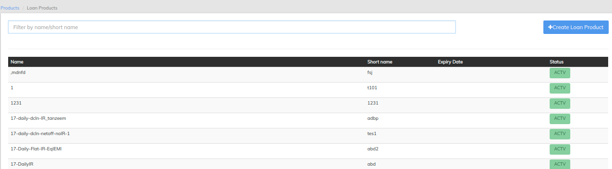

### Edit Loan Product 

Go to Admin>>Product>>Loan Products>>Select loan product (Example: Agriculture loan) >> then click on Edit button. \
In the image shown above, View - Loan products details as well as you can Edit Loan product. &#x20;

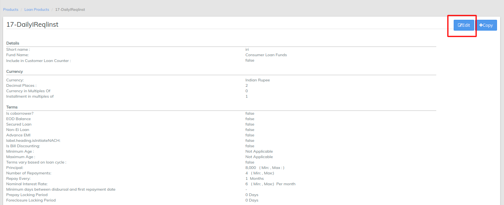

## &#x20;
