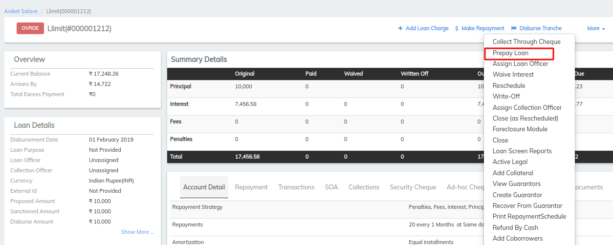
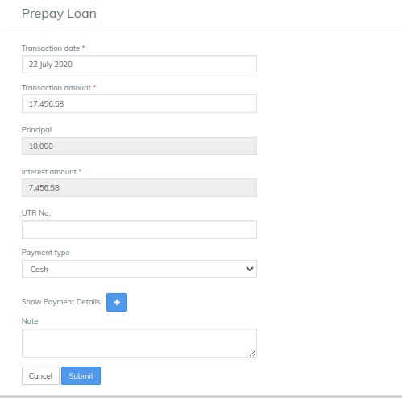

# Making Prepay of the loan

## Making Prepay of the loan 

In order to prepay the loan for a client:

1\) Go to the Client's profile.

2\) Select the loan account for which the client wants to prepay the balance.

3\) Click on 'Prepay Loan' tab to see the following page.

_4)  E_nter the Transaction Date, Transaction Amount, Payment Type (Mandatory fields) and then click on Submit button.

5\) Clicking on Submit button enables closing of client's loan account which proves that the client has paid all the dues of both principal and interest.&#x20;

