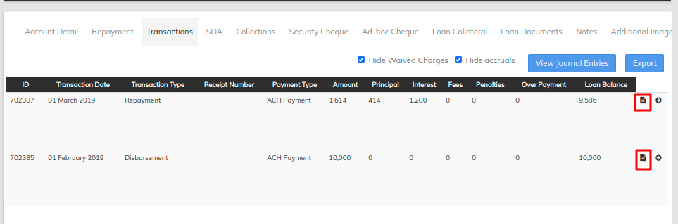

# Receipts In Transaction

LMS has a option of creating a receipts for each transaction is being made and that can be downloaded for further use

Step 1 - Go to client you have created in LMS If not [Create Client](../client-transactions/import-clients.md).

Step 2 - Go to a particular loan account which we have created for client&#x20;

Step 3 - Once the loan account is opened find transaction tab [Loan Screen Overview](loan-screen-overview.md#4-detail-tab)&#x20;

Step 4 - Once the Transaction tab is located go to view receipts for any transaction as we can see in the above image. on clicking on view receipt it will open a receipt.

\>> The above image shows the receipts and can be downloaded &#x20;

