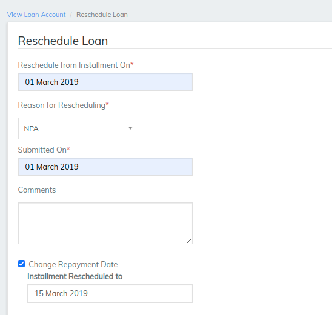
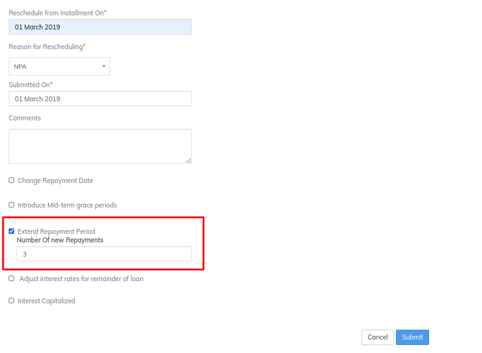
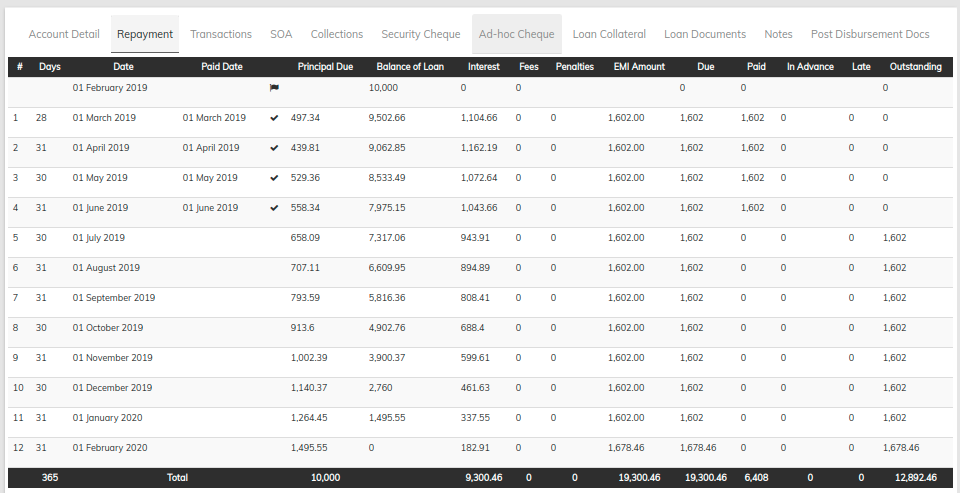
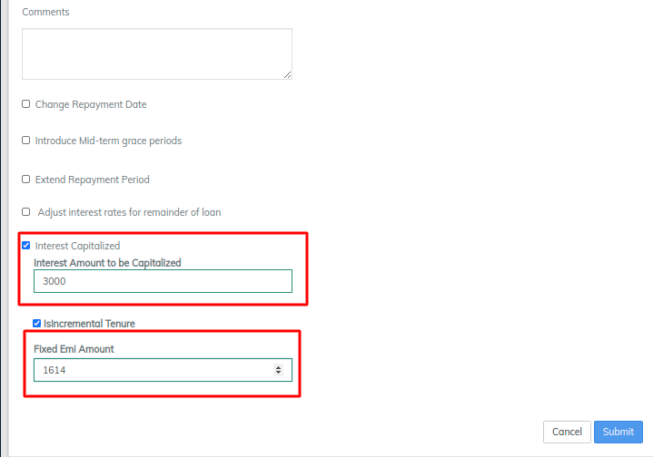

# Reschedule Methods

LMS offers a reschedule methods which affects the repayment schedule, Rescheduling will have an impact on Repayment schedule that is depending on the method which method end user enters or uses&#x20;

Step 1 - To Select Reschedule go to any loan account which is created previously for any client or can create a new loan loan account for a client

Step 2 - Once the loan account is opened Find a More option at the top right&#x20;

Step 3 - Select Reschedule from the list

&#x20;once the reschedule is opened it will lead to new screen which is shown in below image

The reschedule screen has following mandatory fields&#x20;

1. Reschedule from installment on - user has to provide date from which date the repayment schedule should reschedule&#x20;
2. Reason for Rescheduling - This will gives a drop down no of reasons those are tranche disbursal, NPA and so on&#x20;
3. Submitted on Date - On which date the rescheduling activity is submitted&#x20;
4. Comments - This is an optional fields which will asks user to put comment or description why the loan account is being reschedule

## Rescheduling Methods

### 1. Change Repayment date

This Method will change the repayment date which currently is being used by the client lets take an example. if the current date for repayments is 1st of March 2019 and the loan is disbursed on 1st of February 2019 the repayment schedule will look as following image

Then again go to more then reschedule fill the mandatory fields which we have seen earlier in the above image&#x20;

Once the check box is selected for Change repayment date it will asks for Installment rescheduled to date as we can see it in the above image. Enter the date which you wish to select then submit. When we submit the details it will redirect to view loan reschedule request where it can be approved or rejected, also will shows the details we have entered earlier for rescheduling the loan&#x20;

Hit approve then the screen will redirect to approval date enter the approval date for the reschedule and submit.&#x20;

Then go to repayment tab and we can see the 1st March 2019 repayment is changes to 15 for every repayment in the repayment schedule. refer below image

### 2. Introduce Mid Term grace period&#x20;

A **grace period** allows a borrower or insurance customer to delay payment for a short **period** of time beyond the due date. During this **period** no late fees are charged, and the delay cannot result in default or cancellation of the **loan** or contract.

same as we have seen in the first method that is change date the reschedule loan screen is same and the mandatory fields are also same&#x20;

.png>)

This methods gives grace period for no of months entered by end user for principal and for interest Lets take an example where end user gives grace period for Principal is 3 month and for interest also 3, where the loan is disbursed on 1st of February 2019 and  first repayment is on 1st of March 2019

.png>)

Once the check box is selected for Introduce mid term grace period date it will asks for Principal grace period and Interest grace Period as we can see it in the above image. Enter the no of months which you wish to Enter then submit. When we submit the details it will redirect to view loan reschedule request where it can be approved or rejected, also will shows the details we have entered earlier for rescheduling the loan&#x20;

Hit approve then the screen will redirect to approval date enter the approval date for the reschedule and submit.

Then go to repayment tab and we can see from 1st March 2019 repayment is changed it will not collect any Principal amount or any Interest amount for next 3 months refer the image below

### 3. Extend Repayment Period

This method allows us to Extend no of repayments i,e if a loan is disbursed for 2 year tenure then by this method number of repayments are 12 it can be exceed to the number given by end user

Lets Take an an example of a loan which has 12 months tenure disbursed on 1st of February 2019, 1 year tenure means 12 repayments using Extend repayment period  method that can be extended. see the image below has a 12 month tenure before applying extend repayment period

This methods extends the no of repayments as we have seen earlier go to loan account then go to more and select reschedule. Reschedule loan Screen will open fill the mandatory details and apply extend repayment period method by checking the box.

Once the check box is selected for Extend Repayment period it will asks for Number of new repayments as we can see it in the above image. Enter the no of months which you wish to Enter then submit. When we submit the details it will redirect to view loan reschedule request where it can be approved or rejected, also will shows the details we have entered earlier for rescheduling the loan&#x20;

Hit approve then the screen will redirect to approval date enter the approval date for the reschedule and submit.

Then go to repayment tab and we can see the repayments for the earlier loan account was 12 and we have extended it to 3 new repayment hence it will be seen as 15 repayments in repayments schedule

Above image shows that after applying the extend repayment period the repayment schedule will shows no of repayments are 15 instead of 12&#x20;

### 4. Adjust interest rates for remainder of loan

This method of rescheduling will change the interest rate for the remaining loan balance that means the interest rate will get changed for the rest of the loan

Lets take an example of loan account where the loan account is having 12 repayments and interest rate is 12% per month, 4 repayment has been made to the loan account hence 8 repayments are remaining. then the loan account will look like the following image&#x20;

This methods Change the Interest rate for the loan account for remaining loan account  as we have seen earlier go to loan account then go to more and select reschedule. Reschedule loan Screen will open fill the mandatory details and apply extend repayment period method by checking the box.

Once the check box is selected for Adjust Interest rate for remainder of loan  it will asks for interest rate as we can see it in the above image. Enter the interest rate which you wish to Enter then submit. When we submit the details it will redirect to view loan reschedule request where it can be approved or rejected, also will shows the details we have entered earlier for rescheduling the loan&#x20;

Hit approve then the screen will redirect to approval date enter the approval date for the reschedule and submit.

Then go to repayment tab and we can see the Interest rate is being changed for the rest 8 months&#x20;

### 5. Interest Capitalization

**Capitalization** is the addition of unpaid **interest** to the principal balance of your loan. The principal balance of a loan increases when payments are postponed during periods of deferment or forbearance and unpaid **interest** is **capitalized**.

As a result, more interest may accrue over the life of the loan, the monthly payment amount may be higher, or more payments may be required. The chart below provides estimates, for a $15,000 unsubsidized loan balance at a 6.8% interest rate, of the monthly payments due following a 12- month deferment that started when the loan entered repayment. It compares the effects of paying the interest as it accrues, capitalizing the interest at the end of the deferment, and capitalizing interest quarterly and at the end of the deferment.  The actual loan interest cost will depend on your interest rate, length of the deferment, and frequency of capitalization. Paying interest during the period of deferment lowers the monthly payment by about $12 and saves about $426 over the lifetime of the loan.

LMS also offers an option in reschedulling method to capitalize interest, Go to any loan account then find More option then from the drop down go to  Reschedule, as we have seen earlier the screens for different rescheduling method same screen will appear here as well i,e reschedule screen.

Interest capitalization can happen when the grace period is given for the particular loan account and lender wants to collect the interest for the grace period months or moratorium month. Here we take an example of a loan account with 3 months grace period and after that we will collect the interest for these months. In LMS the capitalized interest will be added to the balance of loan of the previous month which is before the interest capitalized month.

Following repayment schedule for a loan account has an 12% interest for a month tenure is 1 year and loan amount is 10000 and one repayment is made of 1614.

As we said before to capitalized interest RBI has given the grace period for the loans for particular time period hence lets apply Introduce mid term grace period for the loan account for lets say 3 month. we will apply grace period from 1st of April 2019 till 1st of June 2019 . Fill the mandatory details in reschedule loan screen, put Principal grace period and interest grace period as 3(3 months) and then submit.

Then the view loan reschedule screen will appear same like for other methods request can be approved or rejected also the screen shows the reason for reschedule and principal and interest grace for the loan i,e details we have filled in reschedule screen&#x20;

Hit approve then the screen will redirect to approval date enter the approval date for the reschedule and submit.

Then go to repayment tab and we can see from 1st April 2019 repayment is changed it will not collect any Principal amount or any Interest amount for next 3 months refer the image below

Now lets apply interest capitalization on the loan account as the lender has given a 3 months grace for the loan its time lender will collect interest for the same. again go to More option and from the drop down select reschedule

Once the reschedule loan screen is open click the checkbox interest capitalization it will ask for the interest amount to be capitalized and it has another option which is to keep incremental Tenure that will exceed the tenure. in which the Fixed EMI which was taken earlier for a loan account earlier in the first repayment which was 1614 can be put as same, mostly lender tend to keep it same as was before as we can see the below image then simply submit

Then the view loan reschedule screen will appear same like for other methods request can be approved or rejected also the screen shows the reason for reschedule and Interest capitalized and fixed EMI amount i,e details we have filled in reschedule screen&#x20;

Hit approve then the screen will redirect to approval date enter the approval date for the reschedule and submit.

Then go to repayment tab and we can see For 1st June 2019 previous amount was 9586/- then we enter the amount to be capitalized 3000/- then the amount will be added to that balance of loan of June month hence it is reflecting as 12586/- then from the month 1st July 2019 repayment schedule will redraw also the interest will be calculate on the new balance of loan amount in this case 12586 and 12% for the month i,e 1510.32/- and the EMI for the rest is also 1614/- we can refer the image below&#x20;

### &#x20;

&#x20;

