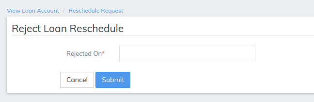

# Tranche loan process

## Tranche loan process 

Tranche Loans are loans which are disbursed in multiple disbursements. An example of Tranche Loan is Home Loans which are disbursed in multiple steps as per the progress in completion of the house/apartment being purchased or constructed.

Example: Completion of the foundation of building – 30% of approved loan amount is disbursed

&#x20;               Completion of the ground floor walls – 30% of approved loan amount is disbursed

&#x20;               Completion of the roof – 30% of approved loan amount is disbursed

&#x20;               Completion of plastering – remaining 10% of approved loan amount

Typically, the loan amount applied for, approved loan amount and total disbursed loan amounts can be different. For example, the client may apply for a loan of 125,000, the approved amount may be 110,000 and the actual disbursement may be 100,000&#x20;

Beginning at the main screen, select [**Admin**](https://mifosforge.jira.com/wiki/display/docs/Administration), then **Products** from the drop-down menu. This will launch the **Products** menu.

Select **Loan Products.**&#x20;

.png>)

#### Create Loan Product  

Provide all the required input for the [Loan Product](../../admin/products-1/create-loan-product/)(Fields), also refer link:- [Loan Product](../../admin/products-1/create-loan-product/)

Go to:- Loan Tranche Details.

_**Provide required details to create tranche product:-**_ 1 - Checking the check box will enable Multiple disbursals.&#x20;

2 - Type of Multi Tranche - it can be keeping the EMI Constant or incremental EMI select accordingly.

3\. Provide the maximum number of disbursements allowed for a loan account. Example: 53 - Provide maximum outstanding loan account balance at a point in time. Example: 100000

4\. **** Maximum allowed outstanding balance: Provide the maximum allowed amount.

5\. Tranche Cut off date - This will decide when to collect principal amount and when to collect interest amount according to cut off date . \
Then click on **Submit** button once you are done with providing all the required fields.&#x20;

#### Create Loan account  

Provide all the required input for the [Loan Account Fields](loan-account-fields.md), also refer link:- [How To Create Group Loan Account](how-to-create-group-loan-account.md)

\>> Once the loan account is created at the right top in loan screen LMS has an option Disbursed tranche

**Step 1- Disbursed tranche screen -** This screen shows the details like max loan amount, max tranche. Enter tranche amount in the below box named as Tranche amount Enter the amount for first tranche disbursal

.png>)

**Step 2 - Date:** Provide the tranche disbursement date. Example: Here the 1st expected tranche disbursement date is on 01 March 2019.&#x20;

**Step 3 - Tranche amount:** Provide principal amount. Example: Here the 1st tranche loan amount is 1000

**Step 4 - Disbursed tranche** Button will lead to next screen which is verify tranche details as we can see it in below image

.png>)

**Step 5 -** Tranche details screen has Next Installment On date and Tranche disbursement on date, the screen also provides add charge button it will add charges for multi tranche which can be created in [Charges](../../admin/products-1/create-loan-product/charges.md) tab or can select previously created charge. Simply click on add charge if you wish to add charge for tranche else submit.

**Step 6 -**. **View loan Reschedule Request -** On this screen the tranche can either be approved or can be rejected.&#x20;

.png>)

**Step 7** - Once clicked on approve it will asked for approval date enter approval date and click submit this will disbursed a tranche&#x20;

If the Tranche is rejected it will ask for rejection date then enter date of rejection and submit&#x20;

**Step 8** - once the tranche is approved click submit the tranche will be disbursed as we can see it in the below image&#x20;

## &#x20;

