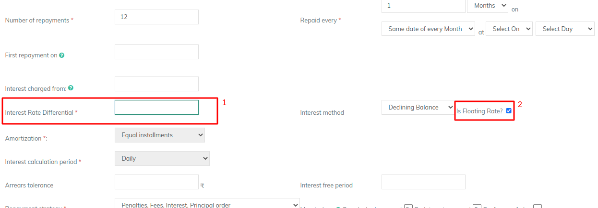
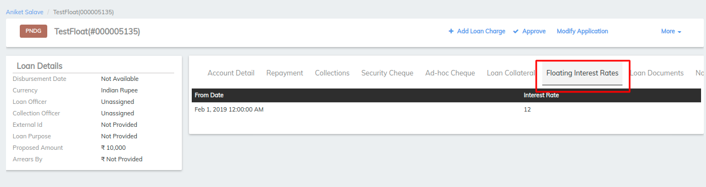
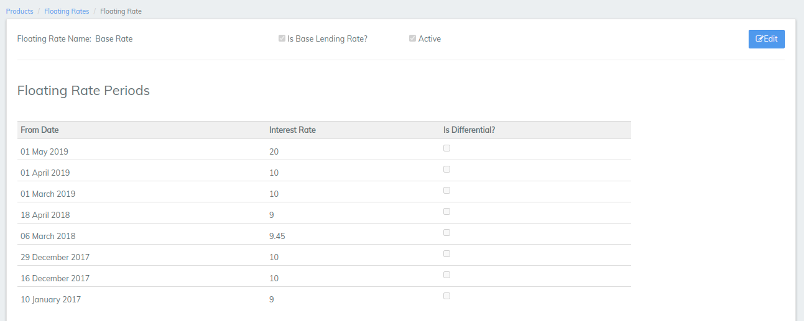
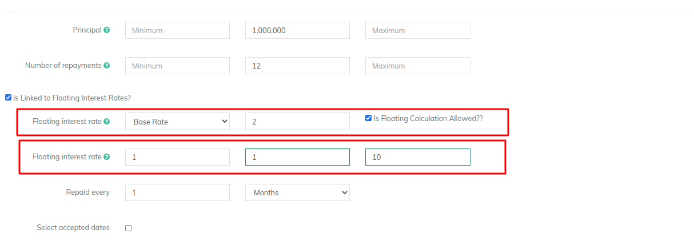
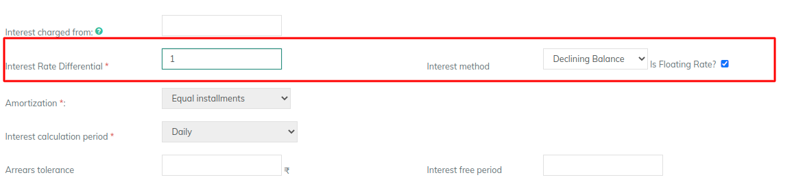
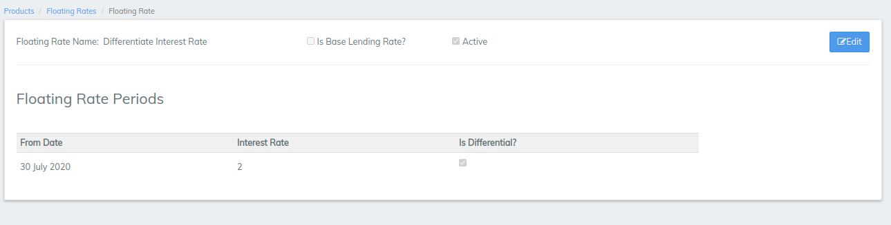

# How to provide floating rates

## How to provide floating rates 

#### **Create loan account - Floating rate** 

To create a loan account application for a client

To create a loan account application for a client, select **** the client by searching the desired client from Global Search. Click the **General** tab.

1. On the Client page, Click **+New Loan** on the bright blue action bar.
2. Select the loan product to base the loan account on from the product list.
3. Complete the [Loan Account Fields](loan-account-fields.md), making any modifications from the default that are permitted and applicable to the loan application.
4. Update required fields -\
   **a) Interest rate differential -** Provide interest rate here. \
   **b) Is Floating Rate -** Check the check box to enable floating interest rate. \
   &#x20;                                \- If unchecked, the disbursement interest rate will be applied and will remain same throughout the installment. \
   &#x20;                                  Refer the example below:&#x20;

5\. Click **Submit**.&#x20;

#### Viewing Loan Product - Applied Floating Rate  

Go to Loan account page >> Floating Interest Rates

Please find below scenarios and configurations for understanding floating rates better:-&#x20;

#### **Scenario 1: With Base lending rate** 

&#x20;    a) Floating Rate definition (Admin>>Product>>Floating Rate)

&#x20;        Base Lending Rate (Checked box) defined as shown in the image below&#x20;

b) Loan Product definition (Admin>>Product>>Loan Product)&#x20;

&#x20;        In the term section - Selected Floating rate is **Base lending rate**&#x20;

&#x20;                                      \-  Differential Rate is **2% (Product level)**&#x20;

&#x20;c) Loan Account definition (Client>>New Loan application)&#x20;

&#x20;      In term section - Interest Rate differential - 1%

&#x20;                               \- Is Floating Rate - Enabled (Checked box) &#x20;

d) In the loan account page >> Floating interest rates&#x20;

&#x20;       As you could see for the interest rate, i.e&#x20;

&#x20;        July 2,2015 - 13% = \[10(Base interest rate) +2(Loan product level) +1(Loan account level)]

&#x20;        Aug 2,2015 - 14% = \[11(Base interest rate) +2(Loan product level) +1(Loan account level)]

&#x20;        Sep 2,2015 - 15% = \[12(Base interest rate) +2(Loan product level) +1(Loan account level)]

Note:- For this scenario **Is Floating Rate** is Enabled (Checked box) at the loan account level.&#x20;

#### **Scenario 2: Without "Is Floating rate enabled" - Loan account level**  

&#x20;          **Is Floating Rate** - **Disabled** (Unchecked box) then, if the loan was disbursed on July 5th, 2015 then interest rate would be without floating rate.

&#x20;           Like shown below:             &#x20;

&#x20;          July 2,2015 - 13% = \[10(Base interest rate) +2(Loan product level) +1(Loan account level)]

&#x20;          Aug 2,2015 - 13% = \[10(Base interest rate) +2(Loan product level) +1(Loan account level)]

&#x20;          Sep 2,2015 - 13% = \[10(Base interest rate) +2(Loan product level) +1(Loan account level)]

#### **Scenario 3: With "Is differential enabled"**  

&#x20;       a) Floating Rate definition (Admin>>Product>>Floating Rate)

&#x20;         \- Base Lending Rate (Must be **Unchecked boxed**),&#x20;

&#x20;         \- Is differential (Checked box) defined as shown in the image below&#x20;

b) Loan Product definition (Admin>>Product>>Loan Product)&#x20;

&#x20;            In the term section - Selected Floating rate is **Differential rate**&#x20;

&#x20;                                          \-  Differential Rate is **2% (Product level)**

&#x20;        c) Loan Account definition (Client>>New Loan application)&#x20;

&#x20;             In term section - Interest Rate differential - 1%

&#x20;                                      \- Is Floating Rate - Enabled (Checked box) &#x20;

&#x20;       d) In the loan account page >> Floating interest rates&#x20;

&#x20;        As you could see for the interest rate, i.e&#x20;

&#x20;        July 2,2015 - 14% = \[10(Base interest rate) +1(Differential rate chart) +2(Loan product level) +1(Loan account level)]

&#x20;        Aug 2,2015 - 15% = \[10(Base interest rate) +2(Differential rate chart) +2(Loan product level) +1(Loan account level)]&#x20;

#### **Scenario 4: Without - Base lending and Is differential**      

&#x20;        a) Floating Rate definition (Admin>>Product>>Floating Rate)

&#x20;         \- Base Lending Rate (Unchecked boxed),

&#x20;         \- Is differential (Unchecked box) defined as shown in the image below

b) Loan Product definition (Admin>>Product>>Loan Product)&#x20;

&#x20;            In the term section - Selected Floating rate is **Absolute**&#x20;

&#x20;                                          \-  Differential Rate is **2% (Product level)**

&#x20;       c) Loan Account definition (Client>>New Loan application)&#x20;

&#x20;             In term section - Interest Rate differential - 1%

&#x20;                                      \- Is Floating Rate - Enabled (Checked box) &#x20;

&#x20;       d) In the loan account page >> Floating interest rates&#x20;

&#x20;        As you could see for the interest rate i.e&#x20;

&#x20;        July 2,2015 - 13% = \[10(Base interest rate) +2(Loan product level) +1(Loan account level)]

&#x20;        Aug 2,2015 - 14% = \[10(Base interest rate) +2(Loan product level) +1(Loan account level)]&#x20;

