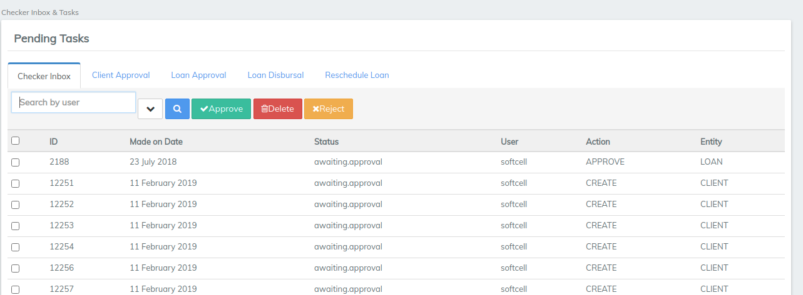
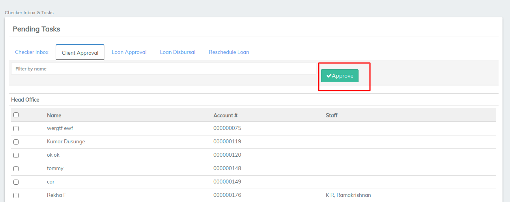

# Checker Inbox

Checker Inbox & Tasks can help:

* Bulk Client Approvals
* Bulk Loan Approvals
* Bulk Loan Disbursals&#x20;

#### How To Use Checker Inbox & Tasks 

* Go to the left panel and click on 'Checker Inbox & Tasks'.

* Once you click on it, the following window will appear showing  pending tasks for clients and loans.\

* Click on **'Client Approval**' to see the list of clients which are not yet activated.

* Select the clients using checker box and then click on **Approve** button. \

* Then Click on **'Loan Approval**' to see the list of loans which are not yet approved.

* Select the loan accounts of the client, and then click on **Approve** button.\

* Then click on **'Loan Disbursal'** to see the list of loans which are not yet disbursed.

* Select the loan accounts of the client which are approved but not yet disbursed.
* And then click on '**Disburse**' button in order to simultaneously disburse multiple loans.&#x20;
