# Co-lending Specs

## Co-lending Product parameters

Any product can be enabled with Co-lending into it. The co-lending product will give a 100% loan overview for customers while still keeping the accounting bifurcated at the partner level.

### Step 1: Add partners

The Partner addition option is present inside Admin>>>Organization

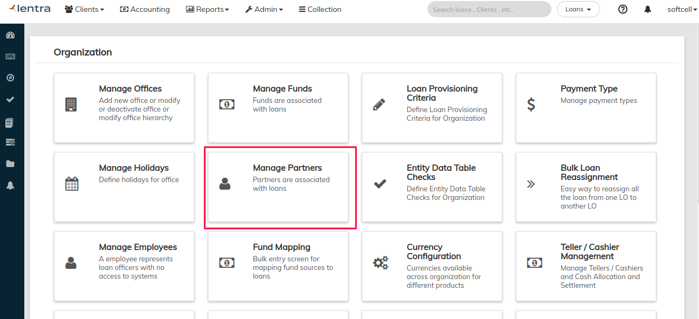

Multiple partners can be added by writing the names and clicking on the “+” button.

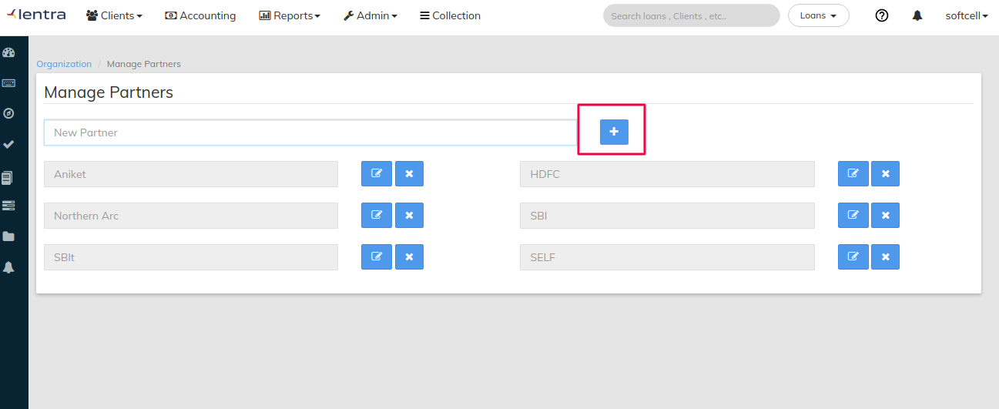

### Step 2: Add Split for Partners

Multiple partners can be selected in the product and then split can be added for each partner

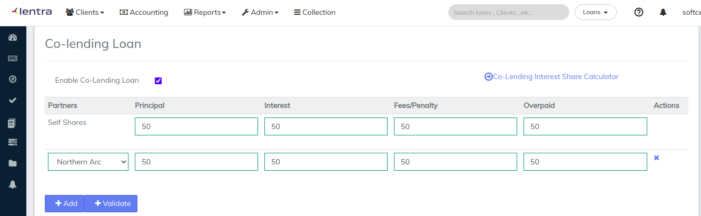

**Process to add Split**

1. Enable Co-lending will allow user to add partners shares for principal, Interest, Fees, and overpaid
2. As we can see in the above image the add button allows us to add no of partners for the particular product
3. Enter the Split for each partner. The sum must be 100.
4. In case split calculation is not readily available, This [link](https://docs.google.com/spreadsheets/u/1/d/12PsIJaT3GPOkoBHkB-IqqrhOQ1fJq3fMWVZEhZUBhmc/edit?usp=sharing) can be used to calculate the split if you have IRR and the principal funding split

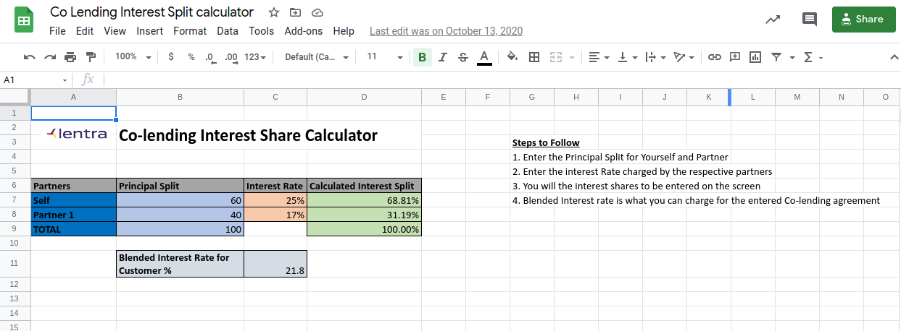

1. The second button which is Validate will make sure the shares are divided equally 100% among the partners for principal, Interest, fees and for overpaid.

### Step3: Advance Split for Fees and Penalties

The Following parameter allows the end user to bifurcate the shares for charges applied to the particular loan. Example: Processing fee can have 50:50 but bounce charge can have 90:10.

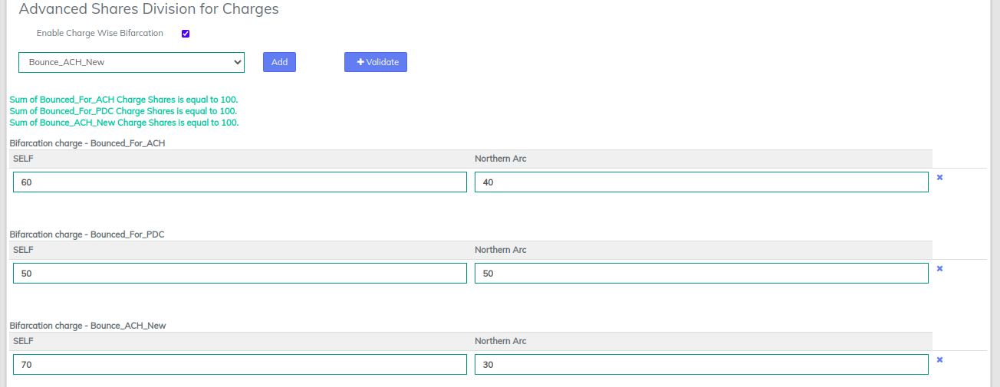

* Enabling the charge wise bifurcation option will give the end user the list of charges to select from a drop down list which are already created in the system.
* As we can see in the above image the charges shares also has to be equally divided to 100% between partners
* Clicking on Validate will shows the message that the sum of charge shares is equal to 100

### Step4: Advanced Share Split for Charges

On default all the charges for a co-lending product will get bifurcated into ratio that is decided at a product level. If user wants different bifurcation at charge level then “Advanced Share division of charges” can be used/

* Select the charge in which you a different ratio from the dropdown and then click on “Add”.
* After that you need to fill the self and the partner’s share.
* Same you can do for multiple charges as well

.png>)

###

### Step5: Accounting Ledger Mapping for each partner

Accounting can be selected to be kept on for the partner and the self portfolio. The below screen shows example of Adding accounting the the self portfolio.

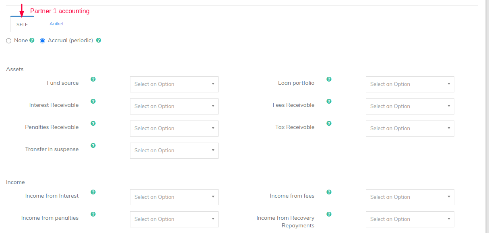

The below image shows if you want to **turn-off** accounting for partner2

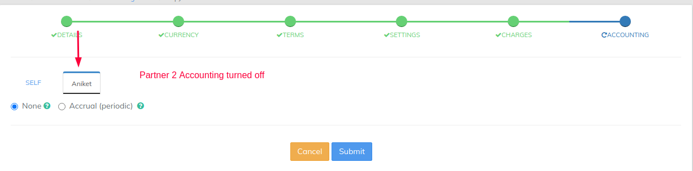

The below image shows if you want to **add** accounting for partner2

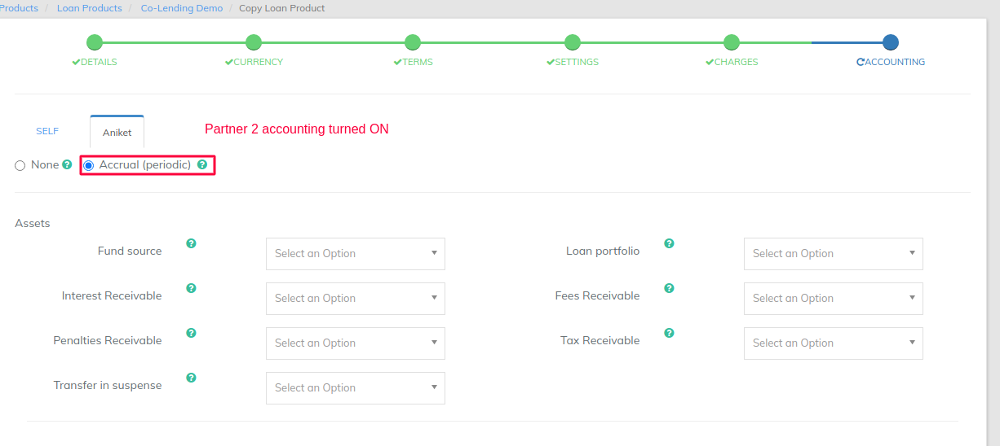

## Loan Level Co-lending Features

### Feature 1: Transaction and GL Entries in the Loan

GL entries will show the exact amount of shares which are given in the Colending product.

Example1: GL Entry for **Disbursement** of loan is shown in the below image, as we can see the shares are exactly divided by 50-50% as they have given in the Colending product at the time of the creation

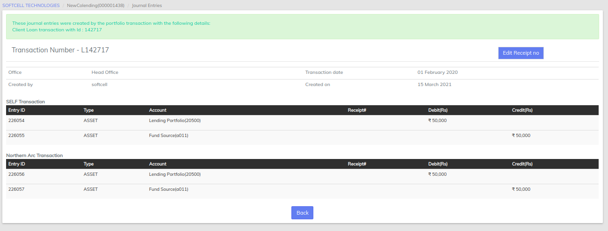

Example2: GL Entry For First **Repayment** of the loan is shown in the below image,

Share in the below image is divided into 50-50% as they have given in the colending product at the time of product creation

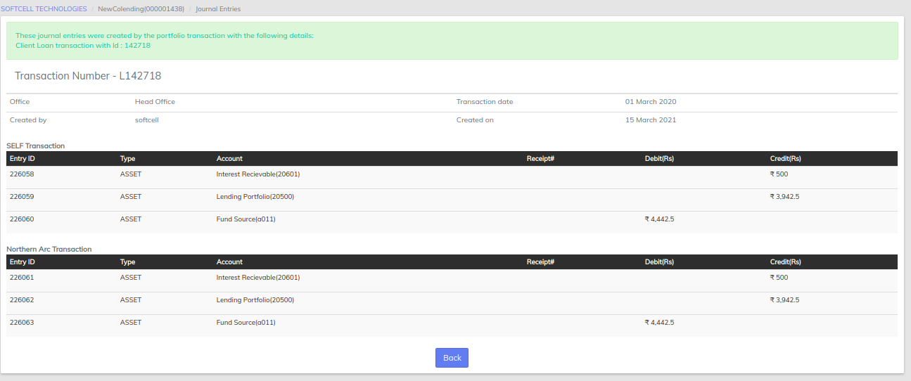

Example3: Charge Split entries and shares between partners are shown in the below image. The split is 60:40

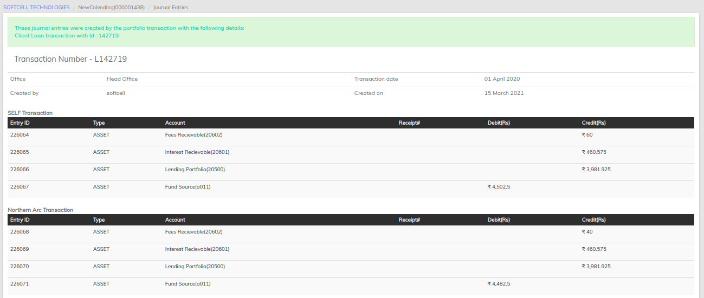

Example4: Charge split entries and shares between partners are shown in the below image. The split is 50:50

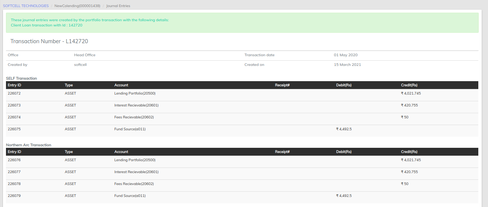

### Feature2: Partner wise Repayment Schedule

The partner wise repayment schedule can be viewed in the reports and also can be downloaded for reconciliation purposes.

Partner 1 Schedule

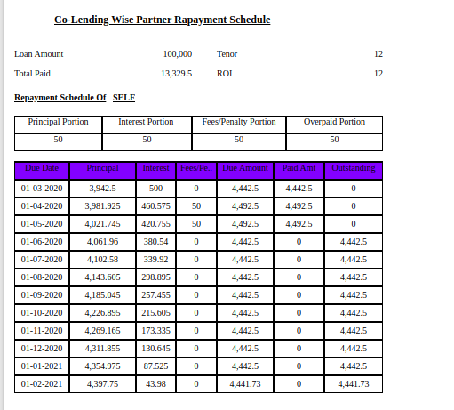

Partner2 Schedule

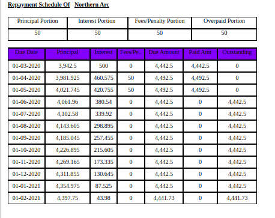

### Feature3: Customer Schedule and SOA

Even though the schedules are generated for each partner, the customer level reports are also available and all the loan servicing options are available at 100% level as well.

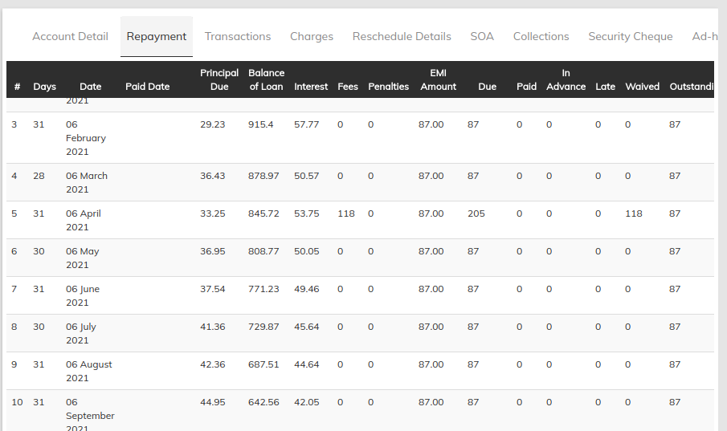

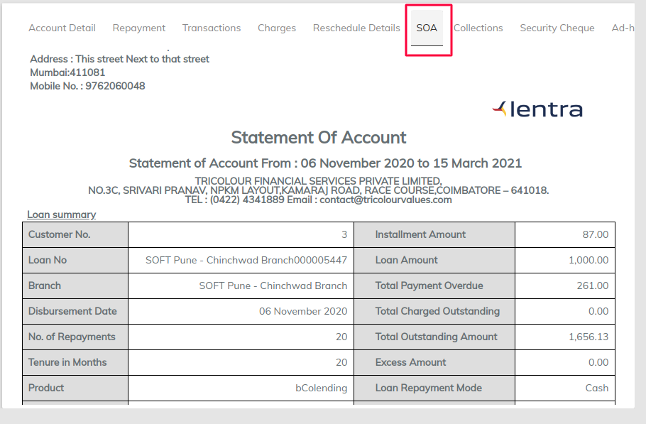

## Sample Co-lending Schedules

Please refer to this excel.

Sheet1: Customer Schedule

Sheet2: Self (partner1) Schedule

Sheet3: Partner 2 Schedule
