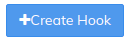
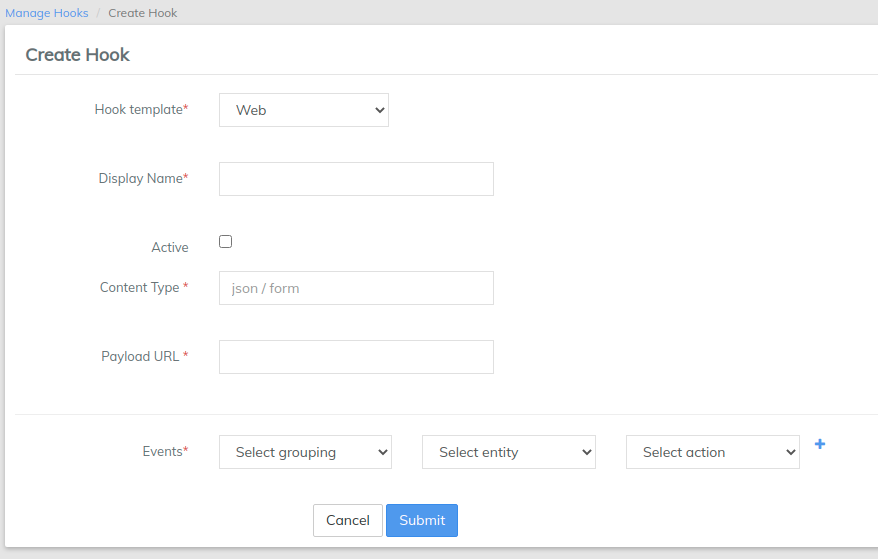

# Webhooks

Hooks are a mechanism to trigger custom code on the occurrence of events. In other words, Hooks are notifications sent to any external application (which can be accessed through a web address) from LMS in the format the external application wants.  Each template during hook creation represents custom behavior on what actions should be taken on the triggering of a registered event for a hook. The action taken might be firing an HTTP request to another server or executing an internal code.

You can create two types of Hooks using **Hook Templates**.

* &#x20;Web
* &#x20;SMS Bridge

## Create a Web Hook

1. Go to Admin >> System and click on Manage Hooks.

&#x20;    2\. Click on 'Manage Hooks' and then click on  to see  the following window. (Here, select Hook Template as "Web" from drop-down menu)

&#x20;    ****     3. "Create a Web Hook" Fields:\
****

| Sl.No | Field Name    | Drop-Down Parameters                                                                                                                                                                                                                                              | Description                                                                                                                                                                                                                                                                                            |
| ----- | ------------- | ----------------------------------------------------------------------------------------------------------------------------------------------------------------------------------------------------------------------------------------------------------------- | ------------------------------------------------------------------------------------------------------------------------------------------------------------------------------------------------------------------------------------------------------------------------------------------------------ |
| 1     | Hook template | Select Web                                                                                                                                                                                                                                                        | Select the 'Web' hook in this case.                                                                                                                                                                                                                                                                    |
| 2     | Display Name  | None                                                                                                                                                                                                                                                              | The name of the template that is being called.                                                                                                                                                                                                                                                         |
| 3     | Active        | None                                                                                                                                                                                                                                                              | Please Check it to trigger the hook.                                                                                                                                                                                                                                                                   |
| 4     | Content Type  | None                                                                                                                                                                                                                                                              | The format in which the external application is expecting the notifications to come in. JSON ([application/json](http://en.wikipedia.org/wiki/JSON#Data\_types.2C\_syntax\_and\_example)) or FORM ([application/x-www-form-urlencoded](http://www.w3.org/TR/html401/interact/forms.html#h-17.13.4.1)). |
| 5     | PayLoad URL   | None                                                                                                                                                                                                                                                              | The web address at which the external application is expecting notifications to come in from LMS                                                                                                                                                                                                       |
| 6     | Events        | <ul><li>Account Transfer</li><li>Accounting</li><li>Authorization</li><li>Configuration</li><li>Data table</li><li>Jobs</li><li>Organization</li><li>Portfolio</li><li>Portfolio_Center</li><li>Portfolio_Group</li><li>Survey</li><li>Transaction Loan</li></ul> | You can select any one of the event for which the hook is triggered for.                                                                                                                                                                                                                               |
| 7     | Select Entity |                                                                                                                                                                                                                                                                   | For each selected event (Example: Portfolio), you have to select the entity from drop-down list like, Loan, Center, Client etc (for Portfolio event)                                                                                                                                                   |
| 8     | Select Action |                                                                                                                                                                                                                                                                   | For each selected Event and Entity, you have to select the specific action from the drop-down list.                                                                                                                                                                                                    |

&#x20;     4\. Click on "Submit" button to create a 'Web' Hook.&#x20;
